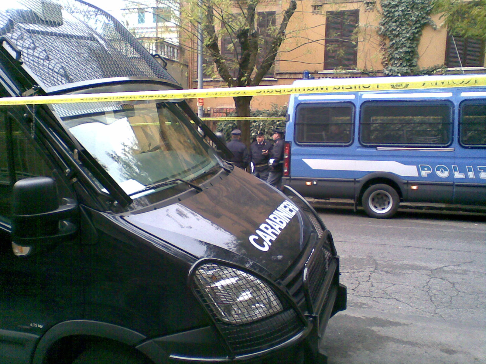

{.center}

The yellow municipal tape has been up for a few days, warning drivers not to park along the street after midnight last night. And this morning, the street was almost clear, one or two stragglers being loaded onto tow vehicles. Cops of all stripes everywhere, and sniffer dogs, and important looking people. I asked a cop who was arriving. “The Pope.” When? “I don't know.” 

Looks like he’ll be visiting a local hospice, and on the way back from the park there was a small gaggle of sightseers, many of them nuns, who watched a silver-haired gent and a woman in furs and huge dark glasses exit a big old limo. Who says nothing ever happens round here?
