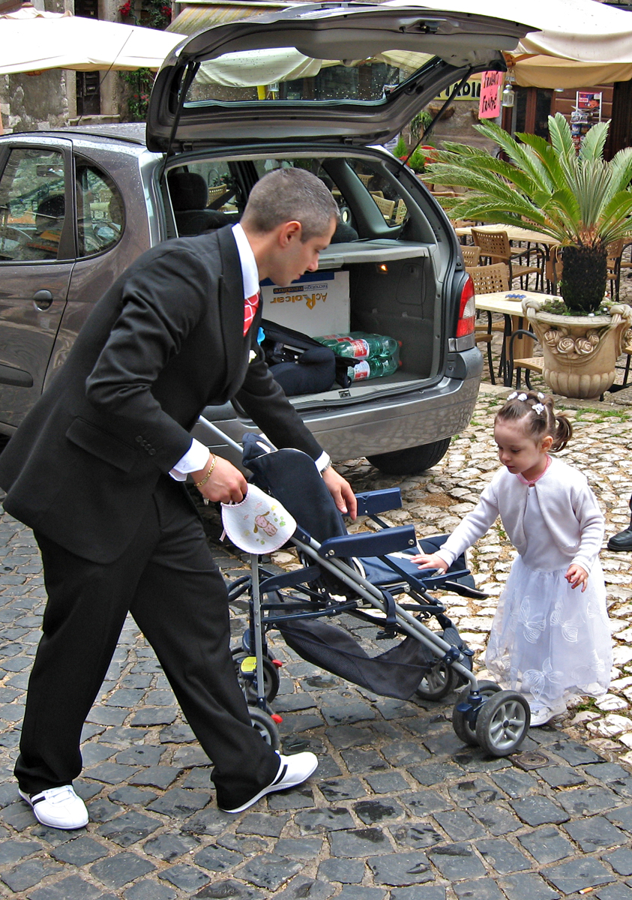

{.center}

That much-limned innate Italian sense of style was greatly in evidence last weekend, in the beautiful little hill-top town of Sermonetta. It seems to be the time of year for [first communions](https://en.wikipedia.org/wiki/First_Communion), about which I know only what I just read in Wikipedia, which doesn’t tell me whether this is in fact a time of first communions or whether I just happen to have come across two, independently, kilometres apart, and from which my pattern-seeking brain naturally jumped to the obvious conclusion: that it is the time of year for first communions. Or maybe it was a wedding, it having been a Saturday.

Anyway, among the crowd thronging out of church in Sermonetta was this beauty ... and his little girl. I couldn’t help but admire the cut of his fine new suit and, more particularly, his even finer sneakers. Brand new. With nicely toning black stripes. Just after the moment I captured his pal appeared, wearing a natty pale beige suit and, yes, orange-trimmed trainers.

If this is a new fashion trend -- and once again two sightings are obviously more than mere coincidence -- you can say you saw it here first.

Seriously, that innate Italian sense of style is pure rubbish. The amount of crappy furniture and decoration is something to marvel at. But even more so the fashion victims that every day adorn the streets. Don’t they look in a mirror before they exit the house? If they do, do they like what they see?

If I had the balls, and the Italian, I’d flatter them into letting me take an honest-to-God picture, rather than snatching a snap. I must try.
