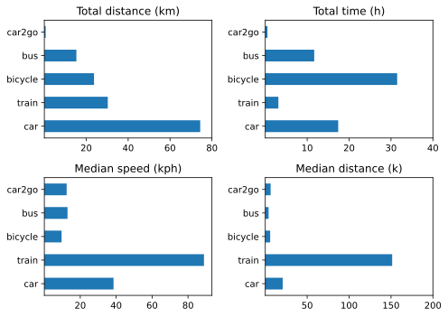

Finally found time to summarise the first quarter of data that Overland collects for me.

{.center}

The biggest surprise is the amount of time spent on the bicycle as opposed to in the car. Some of that difference was caused by the absence of the car for about three weeks, the result of some thieves helping themselves to my catalytic converter. And some of it is inflated by the fact that when I am out for a long ride, I tend to leave Overland running rather than stopping and starting, which creates too many trips. (I do pause and resume the Workout app, but as far as I can tell you can't pause and resume Overland, only start and stop.)

There were also four flights and a few taxi rides, but too few to include. No huge takeaways, no great distances covered, just a pleasing summary.

My next effort will be to create a monthly grid of each day's path. The basic pieces are there; I need to join them up.
