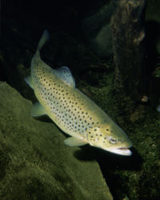

Fish stories excite me. I don't know why. I can think of few things less interesting than sitting on a riverbank watching a float bob. But scientific investigations of similar topics make my pulse race, maybe because there can be few subjects that so perfectly illustrate the all-too-human inability of humans to act rationally. It has been a good week for them.

{.left} First off, what seems like a very counter-intuitive result: to get more predators, [cull their prey](https://www.science.org/doi/abs/10.1126/science.1141412). In the lakes of Scandinavia, brown trout ([_Salmo trutta_](https://en.wikipedia.org/wiki/Brown_trout)) eat arctic char ([_Salvelinus alpinus_](https://en.wikipedia.org/wiki/Arctic_char)). In northern Norway (and elsewhere) trout populations have collapsed as a result of overfishing. And the population stayed collapsed even after fishing was banned, even though there were plenty of char for them to eat. This sort of thing has been seen before, a flip into a different steady state that is just as ecologically sound but that deprives humans of their entitlement. How to flip it back?  Fifteen years ago, Lennart Persson of Umeå University in Sweden and two colleagues spent five years removing “old stunted individuals” of arctic char from Lake Takvatn in northern Norway. They hauled off 660,000 char, 80% of the stock. In 2005, brown trout numbers were 30 times higher; odd, when 80% of their food had been removed.

Persson explains it like this. Overfishing resulted in too few trout, which allowed too many char to grow too big for the remaining trout to swallow. Indeed, the larger char now competed with the trout for other food, such as insects. With the big char out of the way, the trout feasted on the remaining smaller fish, in the process selecting for individuals that grew fast and reproduced young. As Lennart says, ”the predator causes an increase in its own resource’s — small prey — availability by eating on it”. That sounds suspiciously like farming.

Could this message be applied more widely? What about cod stocks in the North Sea and Baltic Sea?  Could it be, Lennart asks, that increasing the catch of herring and sprats, which cod eat, would result in a similar rebound of the cod? Seems worth a try, not least because nothing else seems to have worked, and just why that is so is the subject of another paper in _Science_.

John Beddington and Colin Clark, gods among fisheries scientists, along with D.J. Agnew, review [Current Problems in the Management of Marine Fisheries](https://www.science.org/doi/full/10.1126/science.1137362). It is a terrific paper, which I will not quote from at length because it is, inexplicably, available in full.[^1] (How do they make these decisions at _Science_?) Anyway, they take as their starting point the very common perception -- among fisherfolk too -- that the reason almost all commercial fisheries seem to have failed is that fisheries management has failed. In particular, management regimes often allow fleets to be too big and too efficient, they often consider only the target species and not the ecosystem in which is it embedded, and they "fail to enforce unpalatable but necessary reductions in fishing effort on fishing fleets and communities".

This latter is the real bone of contention. Beddington et al. are too politic to say so, but what generally happens is that scientists such as themselves tell management that there's a problem and what to do about it. Management then ignores their advice because of the short-term hardship it would cause fishing communities etc, ignoring the long-term hardship that overfishing will cause.

Beddington, Agnew and Clark carefully review the good examples of fisheries management and come up with a prescription for success. As they say:

> There have been successes in fisheries management, and we argue that the tools for appropriate management exist. Unfortunately, they have not been implemented widely. Our analysis suggests that management authorities need to develop legally enforceable and tested harvest strategies, coupled with appropriate rights-based incentives to the fishing community, for the future of fisheries to be better than their past.

The crucial part of this is the "rights-based incentives". Individually allocated transferable annual catch quotas are the tool of choice. They are individual, so they give fishers an incentive to build up and sustain stocks, and they remove the competition that is the undoing of most management schemes. They are transferable, so they allow a fleet as a whole to settle on who will actually fish, and how much to pay for the opportunity. And they are annual, meaning that they can respond to scientists' best estimates of the overall catch that could be allowed.

But they do require tough enforcement, and that takes both money and guts. Will it happen? One can only hope.

Now, the added value, tying Persson et al. to Beddington et al. A report in the [Asian Tribune]~~http://www.asiantribune.com/index.php?q=node/6242~~ says that 2½ years after the tsunami Sri Lanka's fishing industry still lacks large, powerful boats, and, counter-intuitively again, the total catch is suffering as a result. For one thing, larger boats go out for more than a day and access deeper water, so those fish are "missing" from the Sri Lankan catch. But worse, well-meaning donors have contributed to low catches in near waters by providing too many boats. An FAO survey reveals that more than half of the 13,000 small boats distributed after the tsunami are in the hands of people who were not fishing before the tsunami. As a result there are, as ever, too many people chasing too few fish, competing with one another and therefore driving down the stock on which they all depend. I suspect that it would be simply too expensive to manage the inshore fishery effectively from on high. But I wonder whether some sort of community level individual transferable quota, enforced by shame and opprobrium, might work. But I don't think there's any way to solve the problem Persson style, by removing the prey, because the problem is not too few predators but too many.

[^1]: 2022-07-27: No longer, alas. And the Sri Lankan reference has vanished without trace, although there are plenty of academic analyses of post-tsunami reconstruction to be found.
