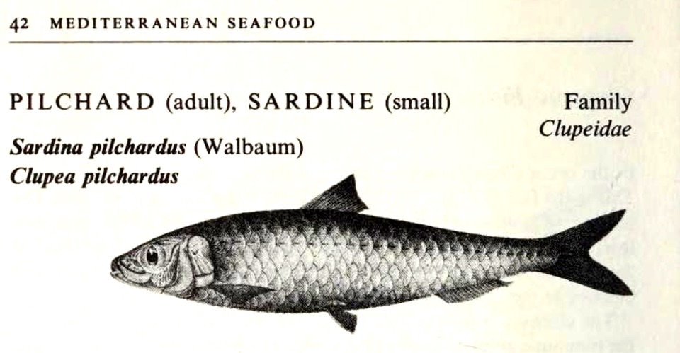
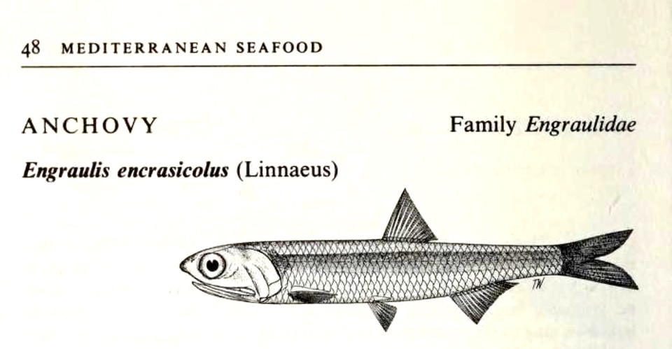

> “An anchovy, to get to an important point, is a larval sardine (_Engraulis encrasicolus_). Around Nice, anchovies are called poutines (not to be confused with fast-food from Quebec).”

This, from a writer I have long respected for their meticulous research, rang alarm bells. Nowhere, ever, have I come across the idea that an anchovy is a larval sardine. A sardine, I’ve always thought (known?) is a young pilchard. And an anchovy is ... an anchovy. These days, though, you can’t be too sure, so I turned to the magisterial _Mediteranean Seafood_ by the master, Alan Davidson (2nd edition, Penguin, 1981).

My worst fears, confirmed: [Someone is Wrong on the Internet]((https://xkcd.com/386/).

===

{.center}

Davidson is clear. What people in Britain call a sardine is a young pilchard, _Sardina pilchardus_, though elsewhere many different species of small fish are called sardines.

He adds:

> “Larval sardines and anchovies (p. 48) are known as poutine or poutina in the south of France, and bianchetti or gianchetti in parts of Italy”

Could that be the source of the confusion? It is ambiguous. Are poutines larval sardines **and** larval anchovies, or are only the sardines larval?

In my opinion, that “larval” is misleading, because the larval stage for sardines and for anchovies is only a few millimetres long, simply floating along with other plankton. Perhaps the sentence would be clearer as “Anchovies and small sardines ...”. At any rate, that’s how I read it.

Turning to page 48, Davidson correctly identifies the European anchovy as _Engraulis encrasicolus_ and he offers a useful tip. “Note that the lower jaw projects markedly less than the upper one.”

{.center}

!!! Obligatory self-promotion: The Swedish Fish Conundrum (_ansjovis_ are sprats, not anchovies) came up in 2024’s Christmas Special [Sensual, Salty, and a Little Bit Spicy](https://www.eatthispodcast.com/gilda/).

Syndicated to <a href="https://www.eatthispodcast.com/sardines" class="u-syndication">Eat This Podcast</a>.
 