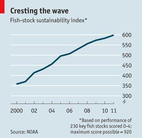
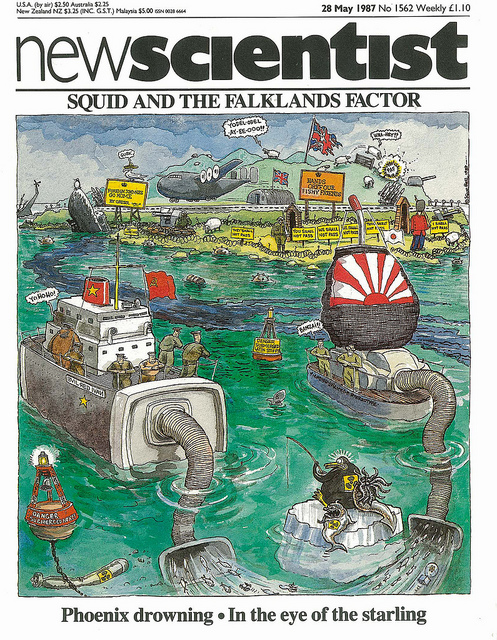
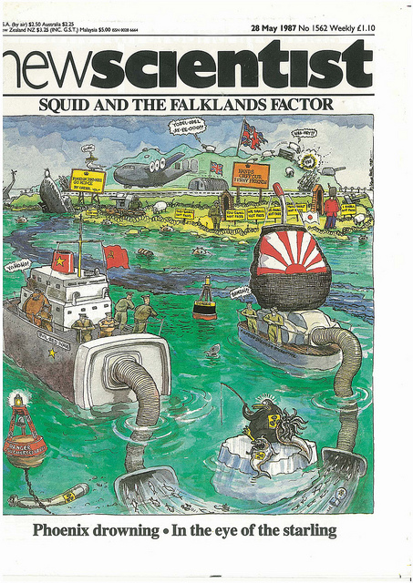

In a coincidence little short of astonishing, last night I came across the cover for an issue of *New Scientist* published 25 years ago to the week, while this morning on the train I read an article from last week's Economist. The link? Fish. And more specifically, how scientists generally do a better job of managing fish stocks than the people whose lives actually depend on those stocks.

{.left} The Economist's article [Plenty more fish in the sea](http://www.economist.com/node/21555960) points out that under good management, stocks in American waters are returning to health. And the reason is that America learned "a simple truth--that scientists, not fishermen or politicians, should decide how many fish can be caught--and enforcing this with simple rules". Of course, all is not rosy. An attempt to give fisherfolk [^fn1] a long-term, tradable interest in healthy stocks was recently defeated. As The Economist noted: "Sadly, the two Republican congressmen behind the ban consider they have been designed 'to destroy every aspect of American freedom under the guise of conservation'."

As for the New Scientist cover, it related to the scientific management of [fisheries around the Falkland Islands](http://books.google.it/books?id=7cie1S3hpC0C&lpg=PA20&dq=new%20scientist%20no%201562&pg=PA44#v=onepage&q&f=false). Not by me, I hasten to add, although I did write quite a bit on the subject. The reason I remember it, and indeed saved it, is that it was one of the only times I remember New Scientist being in the least bit "delicate" about giving offence. At the last minute, after the proof I snagged, a minor change was made to the cover. Here are both versions.

{.center}

[Original](https://www.flickr.com/photos/73529121@N00/7307083946)

{.center} 

[Retouched](http://www.flickr.com/photos/73529121@N00/7307084274)

You'll probably need to click through to the originals to see the difference.

Happy days!

[^fn1]: Yeah, I know … 