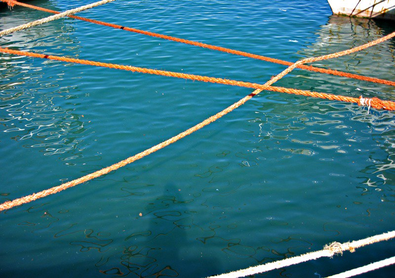

{.center}

[Biopolitical](http://biopolitical.blogspot.com/2006/04/transferable-fishing-quotas-and-equity.html) alerted me to a paper by Colin W. Clark summarising the current state of [misunderstanding of fisheries economics](https://esj-journals.onlinelibrary.wiley.com/doi/abs/10.1007/s10144-006-0255-2).[^1] This prompts two thoughts, one about Clark, the other a response to Marcelino Fuentes, proprietor of Biopolitical.

===

[^1]: 2022-04-12: Paywalled now, I discover today.

Clark was responsible for an epiphany of sorts. When I was [reporting](https://www.amazon.co.uk/o/ASIN/0140118446/258-2361273-3371948?SubscriptionId=02ZH6J1W0649DTNS6002/258-2361273-3371948) on the meetings of the International Whaling Commission, way back, I simply could not understand why whalers had brought their golden goose to death’s door. Simple-minded conservation suggested that they were failing to manage the stocks effectively even for their own future. It was a couple of papers of Clark’s that set me straight. They introduced me to the importance of the discount rate in considering the incentives to conserve natural resources.

At its simplest, money in the bank grows faster than whales in the sea. Which means that the _rational_ strategy for a whaler is to pursue every last whale until there is simply no profit left in them, and then take the gob of accumulated capital and despoil some other resource, like tropical timber.

All sorts of neat ideas follow. Like the fact that if you can buy a whaling fleet on the cheap, perhaps because its former owners have decided to quit, it will make sense for you to continue whaling much longer, squeezing the last drop of profit from your rust-buckets and the remaining whales. And that is exactly what Japan did, courtesy of the enlightened whalers of Europe, America and Australia.

Let whaling go commercially extinct, and it would likely leave quite a few whales in the sea, there to recover to the point where it might, just possibly, make sense to build a new whaling fleet. But by then, I guess, the world would not permit such an activity to start. Let whaling shrink slowly, beset by campaigns and moratoria and moral outrage, and by contrast it seems likely that the reduced profits from fewer whales help to sustain a continued kill that just possibly slaughters more whales over its course than would have died on the way to a commercial collapse.

That is what I owe Colin Clark: my simple minded belief in good-natured biological conservation has forever been displaced by an appreciation of the importance of real-life economics. Which is why I was delighted to read his recent views on fisheries management, even if he doesn’t deal with very slowly reproducing species.

Fuentes, meanwhile, takes issue with Clark’s idea that individual transferable quotas (ITQs) have, to date, been characterized by “an unjustified, and highly unpopular, transfer of wealth from the public to specially favored individuals”.

Fuentes does not see why the public at large should “get an income from the activities of fishers”.

> I don’t feel like I “own” fisheries just because I am part of a sea-bordering nation and because the official law says so. I don’t feel entitled to a compensation by the new owner of a quota. Although I would prefer governments to give the quotas to me for free and I am a little envious of the sudden wealth of the actual recipients, five minutes from now I will have forgotten my misfortune and I will go on with my life as usual. I want to be able to buy fish. I prefer that the operation of fisheries is managed and financed privately and not by tax money. I want seas teeming with life. So, I am ok with governments granting quotas for free instead of auctioning or getting rents from them.

I agree that he personally should not get an income in his hand to spend as he likes. But the sea-bordering nation should get something from the fishery, in order to take care of the fishery, something individual fishers will not do, especially for a non-sedentary stock, even if it is in their best interests to do so. As Clark points out:

> The incentive always exists for exceeding one’s quota, so that rigorous monitoring and enforcement of individual catches is essential.

There is also the question of risk management within fisheries, which are notoriously complex ecosystems. On both counts, an effort greater than the individual quota owner’s is needed, as quota setter and enforcer. Like Fuentes, I too want to be able to buy fish and want seas teaming with life. But I am not impressed with how fishers hitherto have approached either of my wants. That is why making the fishers pay for management of the stock by a third party, through royalties or taxes, while leaving them the freedom to manage their own quotas as they see fit, seems to me to be an eminently reasonable solution.
