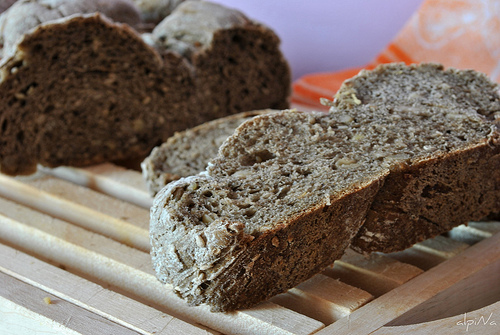

Ordering new supplies of flour yesterday, I came across something called farina di grano arso for sale. Suppressing a titter, I texted my compadre; nope, he'd never heard of it. Chatting to a chum over tea this afternoon, she suggested burned grain (past participle of the verb _ardere_). And she was bang on the money.

===

There isn't a whole lot on the interwebs about this stuff; I did [learn](http://www.parlafood.com/grano-arso-prodotto-tipico/) that: 

> "Peasants too poor to afford flour would sweep up the grains burnt by the hot steam engine machines that harvested them in the fields. They would grind the grain into flour and mix it with water to produce pasta with a smokey flavor."

Or they gleaned grains after the stubble had been burned. Probably both.

There's a bit more, in Italian, along with some recipes for two kinds of pasta, [orecchiette](http://unpezzodellamiamaremma.com/la-farina-di-grano-arso-la-storia-e-le-orecchiette/) and [cavatelli](http://blog.saporideisassi.it/2010/06/cavatelli-grano-arso-pomodorini-cacioricotta/), and a couple of different [recipes](http://www.scattidigusto.it/2010/02/22/piatti-recuperati-il-pane-di-lydia/) for [bread](http://losciefscientifico.blogspot.com/2010/02/pagnotta-con-farina-di-grano-arso.html) and [focaccia](http://www.glutine.com/focaccia-pugliese-con-farina-di-grano-bruciato-di-canosa/).

{.center}

What they all have in common is that the grano arso is cut about 3 or 4 to 1 with ordinary unburnt flour. And everyone seems to rave about the flavour of the finished product. I didn't actually order any yesterday, but I'm going to try and add a little to my shopping basket if it is not too late. It sounds too good not to try.

I do, however, have one question about modern farina di grano arso: is it smoked flour? Or is it flour made from smoked, or burned, wheat?