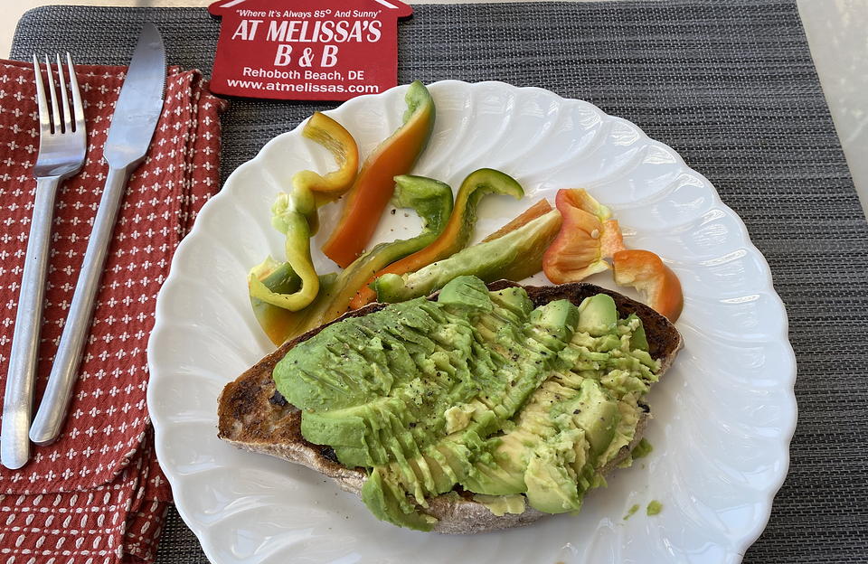

---
title: 'Flaxseed currant ciabatta'
published: true
date: '20-06-2020 14:30'
taxonomy:
    category:
        - blog
    tag:
        - Bread and Cheese
summary:
    enabled: '1'
subhead: " "
header_image: '0'
--- 

Last week I was sorting through my recipe folder — the physical one, which is a mess of printed, scribbled and ripped bits of paper — and came across a bread that I had not made before and that for some reason called to me.

It was very good, so I wrote it up at the other place: [flaxseed currant ciabatta](https://www.fornacalia.com/2020/flaxseed-currant-ciabatta/).

I should note, too, that it made an excellent basis for a canonical hipster lunch.

[{.center}](flax-currant-avocado.jpg) 
