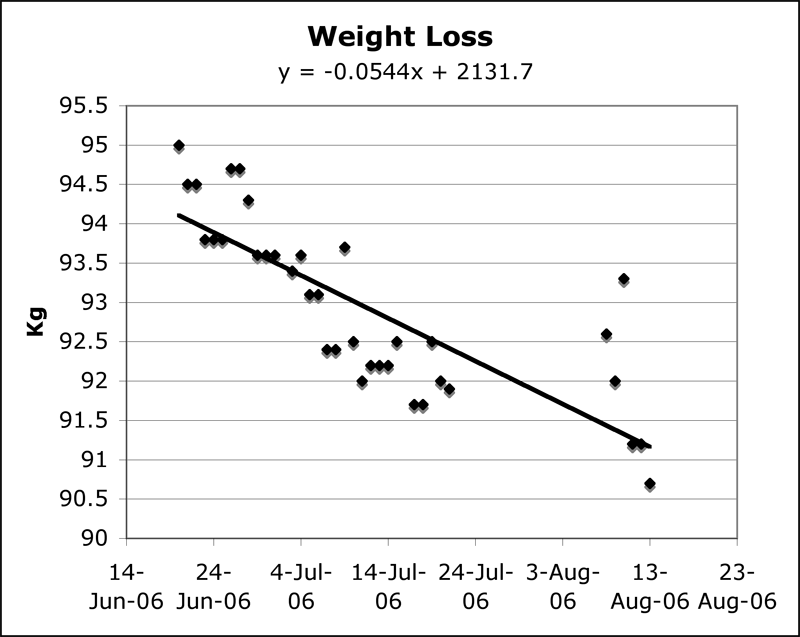

Start: 95.4 Last week: 92.6  This week: 90.3

**Friday 11 August:**  Yesterday, my total solid intake before evening -- and it was not that solid -- was half a (small) slice of watermelon. From time to time a little pang of hunger would grip me. But within minutes it would go away and I felt fine. No idea why. I ate pretty well the day before, but not excessively. And I have a cold, which sometimes suppresses the appetite. In the evening I felt I really ought to have something, and made a small plate (100 gm _vs_ my habitual 125 gm) of linguine, with aglio, olio e peperoncino, as much to attack the head cold as to feed any hunger. It's the next best thing in the absence of hot and sour soup, and it worked, for a while. I find the absence of hunger really strange. And it cuts out some of the little joys of the day, like a slice of Sal's perfect simple pizza. But it does save time. And money.

===

**Sunday 13 August:** Lord but I hate Excel and its chart junk. Still, for a quick and dirty approach on a relaxing Sunday morning, I suppose it will have to do. ("I have no desire," he lied, "to spend the rest of the day looking for a cool, functional graphing package.") So here is a little picture. 

{.center} 

Now to figure out when to celebrate. Under 200 lb (90.9 kg)? Under 90 Kg (198 lb)? Under 14 st (89.1 kg)? At any rate, if the regression line holds up I'll be at target some time around mid-December. Just in time to put it on for Christmas.

**Tuesday 15 August:** Down 2.3 kg in a week. That's probably a little steep. Being on my own much of the time has probably enabled that, in that there was only one social dinner. But before SLD, being on my own would have been an excuse to overindulge. I'm nearing the end of my current bottle of rice oil. I think I'll continue with that, and maybe drop the dose a little.
