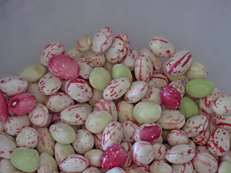
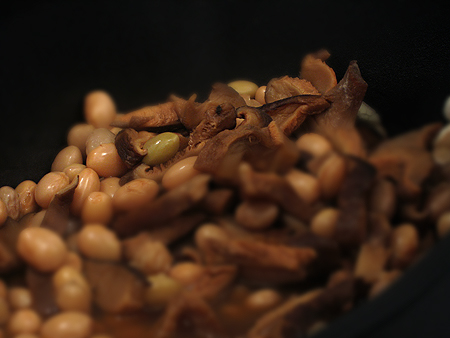
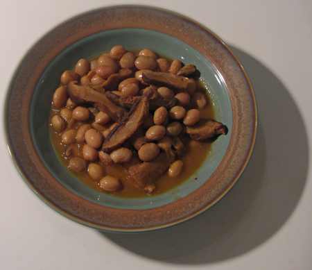

Start: 95.4 Last week: 90.1 This week: 88.6  
**Wednesday 12 December**: Yup, it has been almost two months, and a packed time at that. Barely time to glug my oil. But I'm back on that now, and still bouncing around the 88-89 kg mark. I suppose that by now I should know that it neither goes on nor comes off as quickly as I fear or hope, but it is nice to know that I am more in control. At least, it feels that way.

This has never really been a food blog, more a blog that happens to do food from time to time. This is one of those times.

{.center}

Those there are freshly shelled borlotti beans. Two weekends ago I was idly admiring their beauty when I thought, I ought to share this. So I snapped them, with thoughts of a long and intelligent post on the history of borlottis, their place in regional Italian cuisine, a simple exegesis of their name, blah, blah, blah.

No way. I searched quite diligently (which is why this post is a full 12 days after the event) but could find very little, either on the internets or in my admittedly now somewhat sparse bookshelves. Even the venerable [Beans of New York](https://www.nysaes.cornell.edu/store/catalog/product_info.php?products_id=34&osCsid=156121f0e8183d522669c7ae27e6e7b0) had nothing to say, at least not in the index. While the bean and dried shitake soup bubbled, I therefor mused on the whole heritage vegetable thing.

{.center}

We had been in Dijon the week before, on a flying visit for Thanksgiving under a foreign flag, and of course went to the local market. Very fine it was too, with a vast array of good-looking ingredients. Visitors from the UK and the US find this sort of market quite astonishing, and their normal point of reference is the local farmers’ market. But there’s a huge difference, I think. The farmers’ market is a recreation in both sense of the word. It seeks to create again the kind of market that has largely been lost in the UK and the US, and while it is undeniably hard work, it is also a recreation for buyers and sellers alike. In Dijon, and for that matter, Rome, the fresh market remains a feature of daily life. Those selling may or not be those who grew; it doesn’t much matter. And often those who grew will show up irregularly, either in the market or on any street corner, when they have a surplus of something.

So while the local US or UK farmers’ market may well have a story to tell about Dutch Caseknife beans, or Goose beans, or Vermont Cranberry beans, or whatever, and how they were found, and rescued, and all about them, the local market up the street just has beans. No name -- aside from borlotti -- no history. Just beans. That’s what people buy, that’s what they eat, and I expect they’d be a bit bemused by the reverence with which varieties are treated among a small subset of the population.

Which is not to say that the varieties and their histories and cultural affinities are unimportant. Quite the opposite. But you don't miss your water till your well run dry. I remain hopeful that the fresh markets of Europe will continue to supply a wide diversity of good ingredients, but I also wish that more attention were being paid to gathering up not only the varieties themselves but also the stories associated with them.

{.center}

The soup, by the way, was excellent. I’d give a recipe, but I kind of made it up as I went along. There were a couple of kilograms of fresh borlotti beans, in the shell. I boiled them for about 45 minutes. There was a good handful of dried shitake mushrooms, soaked in hot water while everything else was being prepared. The liquid, minus a little bit of sand, went in too. There was a base of onion, garlic and celery, sweated slowly, to which I added some potatoes and some tomatoes and cooked separately until the potatoes were soft. Then I whizzed that and added it and the mushrooms to the beans and simmered another hour or so.

Just one thing; what is quality control on dried shitake like? I ask because that night I had the most vivid dreams I can remember. Not exactly hallucinatory -- no out and out weirdness of psychedelic colours or melting faces -- but amazingly intense, violent and disturbing. And, although seemingly lucid, there was absolutely nothing I could do to get myself out of the dream. I can’t even be sure whether I was awake or asleep.

The Squeeze experienced nothing out of the ordinary.

Magic? Not really.
