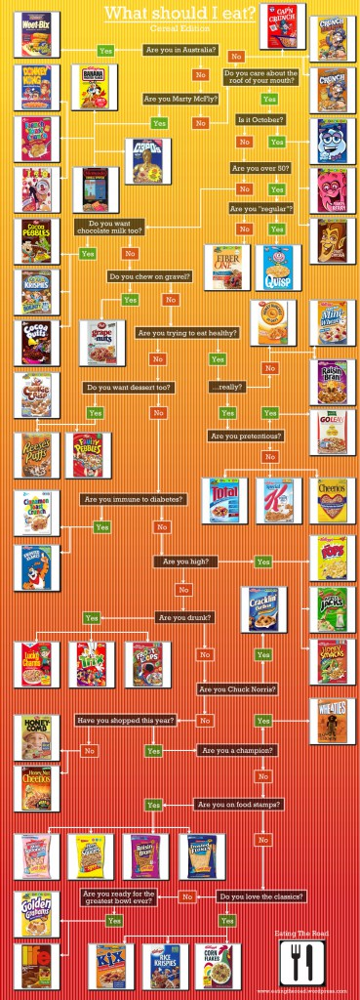

Start: 95.4 Last week: 87.3 This week: 87.6

_Two helpings of everything for Thanksgiving cannot have been the only issue. Maybe it was the fresh almonds?_

Does anyone need a choice of more than 50 breakfast cereals? [Many more](http://en.wikipedia.org/wiki/List_of_breakfast_cereals).

I’m trying to remember that fancy word from economics, where a single supplier creates several goods that look different, so that the poor befuddled consumer doesn’t realise that no matter what they choose, the company wins. It isn’t a monopsony, is it? Anyway, detergents and breakfast cereals are among the classic examples.

[{.center}](where-to-eat-cereal1.jpg)

I ask partly because it gives me the opportunity to link to this [wondrous flow chart](http://eatingtheroad.wordpress.com/2009/11/23/what-should-i-eat-cereal-edition-flowchart/) (click it to enlarge) that might help you reach a decision. And also because I can link to Marion Nestle’s posts about [Smart Choices](http://www.foodpolitics.com/tag/smart-choices/). Such fun. Form an industry group. Decide what levels of which ingredients are “good for you”. Slap a label on those products that meet your own standards, like 44% sugar on a breakfast cereal. And then get professional bodies to give your labels their stamp of approval. An appalling instance of marketing hoopla. 

Breakfast cereals, however, also offer a truly wondrous instance of marketing hoopla. I refer to Diamond Shreddies, a development I had not been aware of until it was so brilliantly exposed on a [Tedtalk by Rory Sutherland](http://www.ted.com/talks/rory_sutherland_life_lessons_from_an_ad_man.html). I’m not even going to try and gloss the idea of Diamond Shreddies. [^fn1] You can see some of the TV ads [here](http://www.youtube.com/watch?v=7lOqeub3Koc) and [here](http://www.youtube.com/watch?v=BOuC5jjTZOI) and I strongly advise you to do so. The campaign seems to have worked, and has been [dissected](http://www.macleans.ca/business/companies/article.jsp?content=20080507_56414_56414&page=1) in many places. What I love about it is that it is so knowing and also that the focus groups, which I’m assured were “real”, are so bereft of real content. Perfection.

Seriously, though, how many breakfast cereals would be enough?

[^fn1]: As Sutherland explains, “Shreddies is a strange, square, whole-grain cereal, only available in New Zealand, Canada and Britain. It’s Kraft’s peculiar way of rewarding loyalty to the crown.” Which is why it isn’t in the flow-chart. And [Wikipedia says Shreddies](http://en.wikipedia.org/wiki/Shreddies) is made by Post Cereals and General Mills, not Kraft, but who knows how true that is? Maybe truer than the claim that “Shreddies are often eaten by guitarists, to help them play fast”.  
