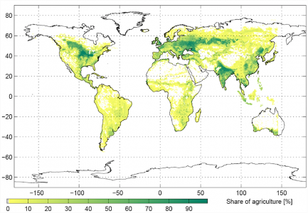
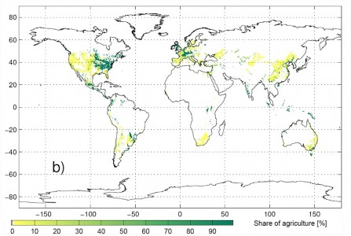

Start: 95.4 Last week: ??.? This week: 88.7

_Last week was a week away on duty travel, normally fatal, but I guess that 24 hours of projectile vomiting [^fn1] was a blessing, in some ways._

I’m not quite sure when it became fashionable to point out that there was no global shortage of food, just unequal distribution. Probably around the time I was being urged to clean my plate because there were starving children in India. And it is true; the world does produce enough food for everyone. Not only that, it could produce much, much more food on much, much less land.

At the first climate-fest of the year, in Copenhagen in March, I was somewhat stunned when Professor Hans Joachim Schellnhuber's [presentation](https://web.archive.org/web/20080628190211/http://climatecongress.ku.dk:80/speakers/) included two slides, one of agriculture as it was in 1995, all spread out around the globe, and one that concentrated all agriculture into the most promising areas, ignoring all other land uses, which, he said, was all the land needed to feed a population of 12 billion (33% more than we seem to be expecting) with as much food, per person, as had been available in 1995. [^fn2]

(Click either one to enlarge.)

[{.center}](Ag-1995.png)

[{.center}](Ag-Optimized.jpg)

Two points I want to make. First, it seems to me that the second map might be fine and dandy for the people who live and work in the areas of concentrated agriculture, but what is the rest of the 12 billion supposed to do? Sit around waiting for that day’s meal to be shipped in? And that’s to ignore the question whether the maps or the average diet cover micronutrients or just calories and protein.

A slightly different point but one that is actually much more germane concerns the concentration of power. I don’t myself trust the geopolitical areas that would be growing all our food to share it equitably, nor do I trust any human institution to make them do so, and if the history of the global food business is anything to go by, they won’t. Concentration of power **is** the history of the global food business.

All of which is a lengthy throat-clearing before I introduce three posts from The Ethicurean that portray power in action: Meet your greens: National Leafy Greens Marketing Agreement hearings, Week 1: [Part 1](https://web.archive.org/web/20181028135853/http://www.ethicurean.com/2009/09/25/nlgma/), [Part 2](https://web.archive.org/web/20091001003932/http://www.ethicurean.com/2009/09/28/nlgma-2/) and [Part 3](https://web.archive.org/web/20091008004715/http://www.ethicurean.com/2009/10/04/nlgma-3/). 

The backstory is simple enough. After _E. coli_ 0157:H7 contaminating spinach greens killed a fair number of people back in 2006, the industry, first in California and now nationwide, went into overdrive to make sure to avoid any blame in future. Right now, this takes the form of a potential Leafy Greens Marketing Agreement, which is the subject of government hearings around the country. The lengthy reports from Elanor skillfully examine what is going on and why, and while I could pull out a long series of extracts, I'll make do with just one, from Part 2:

> Witnesses speak from their experiences with the California LGMA, which was developed by the same industry group after the 2006 outbreak of E. coli O157:H7 in ready-to-eat bagged spinach, and claim that participating in the California program has improved the safety of leafy greens and boosted consumer confidence in the industry. (No one mentions that since the California agreement went into effect, Salinas-based companies have had four leafy-greens recalls for Salmonella or E. coli, nor that the contamination was caught not by the companies, but by random testing by state departments of agriculture. “Effective,” indeed!) A rep from the Texas Produce Association acknowledges that small farmers will probably have a harder time meeting NLGMA requirements than the big guys but still supports it.

Go, read the whole thing for yourself. And bear in mind, this is not an isolated incident. Throughout North America and Europe (and for all I know other “developed” places too) large industry writes the rules not merely to favour itself and its practices, but also actively to discourage all those who would prefer to find a different way. The Leafy Greens Marketing Agreement is not a one-off. It is just the latest manifestation of what happens when too much power ends up in too few hands.

[^fn1]: An exaggeration; I was only actually hurling for about 3 of the 24 hours. 

[^fn2]: He cited Müller et al. 2006, and not being an expert in the field I haven't actually run that one to ground.  
_2021-10-06_: I did so soon afterwards: [Comparative impact of climatic and nonclimatic factors on global terrestrial carbon and water cycles, Müller et al. (2006), Global Biogeochemical Cycles **20**:(4)](https://agupubs.onlinelibrary.wiley.com/doi/full/10.1029/2006GB002742)