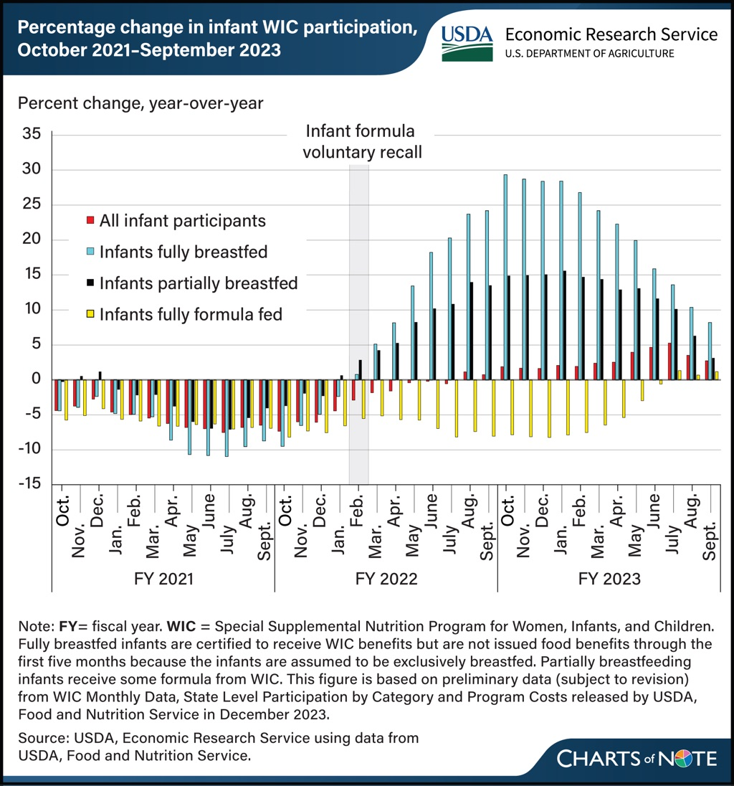

Yesterday’s [graph from USDA](https://www.ers.usda.gov/data-products/chart-gallery/gallery/chart-detail/?chartId=108570) is really interesting. It shows that the February 2022 recall of formula milk in the US, which compounded the supply chain difficulties of Covid, was associated with a striking increase in the number of infants fully and partially breastfed (and a drop in the number fully formula fed).

The survey covers only people enrolled in the USDA’s Special Supplemental Nutrition Program for Women, Infants, and Children (WIC), so it isn’t comprehensive, but it represents a more vulnerable sector of society. It also shows that while formula offers the benefit of convenience, when push comes to shove many women are able to breastfeed more. Of course I would like to see a more detailed breakdown that factors in things like the need to be out working, but I find these results encouraging.

They also suggest a way out for mothers faced with what [today’s Guardian](https://www.theguardian.com/business/2024/feb/20/uk-infant-formula-high-prices-competition-and-markets-authority) said are “historically high” prices for formula in the UK.

> The Competition and Markets Authority (CMA) found in November that the average price of infant formula had risen by 25% in the past two years and families could save more than £500 over the first year of a baby’s life by switching to cheaper powders.

They could save even more by breastfeeding more and for longer.