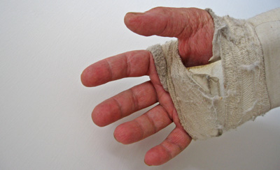
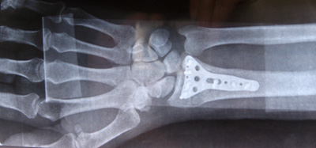
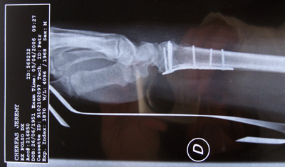
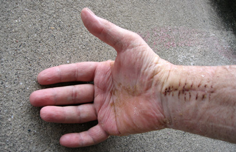

{.center}

So that’s how things were this morning; horrible. Dank, sweaty and stinky.

{.center}

Beneath it all, though, screws had been screwed and bones had knitted.

{.center}

And so today, after only 2½ hours wait beyond a pre-booked appointment, they snipped off the bandage, wiggled the wrist and fingers a bit, and maybe three minutes later, max, told me to leave. And here it is now, still somewhat disgusting.

{.center}

I have to wash it “carefully, like a woman or a baby” and I need some physio. And it is a bit scary. Some things are a lot easier with just the little bit of extra flex and rotation. Others hurt. And it is surprising how swollen everything remains. Still, a weekend in the healing waters of Ischia should help at least a little.
