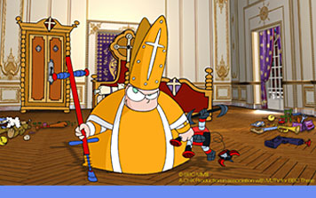

{.center} 

First it was the rabid muslims. Now it's the [rabid Catholics](http://news.bbc.co.uk/2/hi/entertainment/4968614.stm). 

> "In this way the Catholic faith and the Catholic church are exposed to ridicule, which is justified neither by the freedom of opinion, of art, of the press nor of broadcasting," the archdiocese of Munich and Freising said in a statement.

A pox on all their houses.
