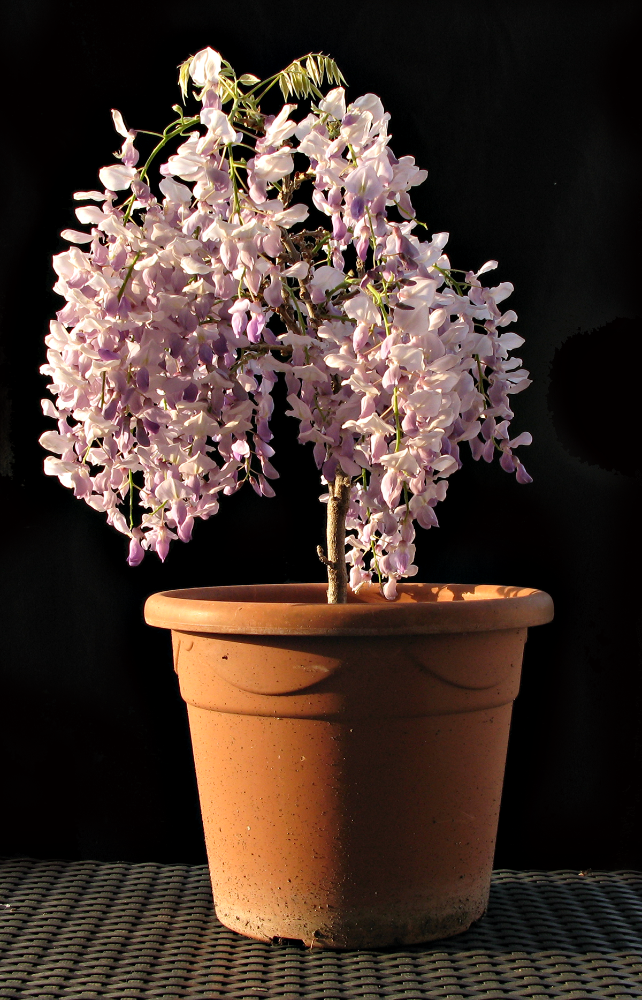
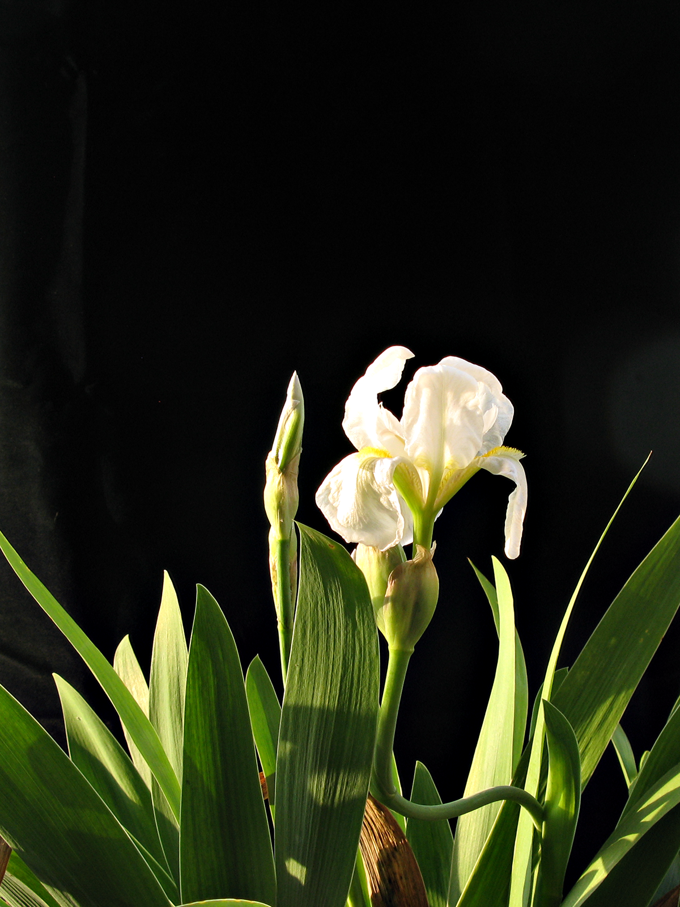
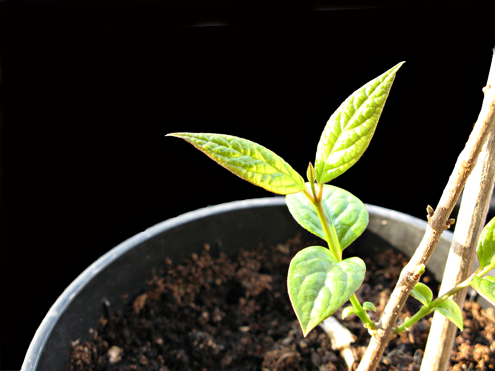

Everything that I wanted to come through the winter has, some of it in rare good form.

The bonsai wisteria, one of seven that I grew from seed I collected in 2007, is still bonsai and flowering for all it is worth. The flower colours and other aspects differ among the seven; I wonder whether I might accidentally have selected for a non-climbing wisteria. That would be cool.

{.center} 

The white iris, rescued last summer from under a tree down by the _orto abusivo_ on the rough ground, opened today too. Very welcome, with a promise of more buds to come. It's covered in aphids, which fortunately don't render on the photograph, and of course I can't find my soapy spray.

{.center} 

But the real beaut, the treasure I had dared not hope might survive, is the _Chimonanthus_. This is also from seed I collected, the only survivor from a few fruits worth snaffled from the gardens at the Villa Wolkonsky, residence of the British Ambassador to Rome. It was the silliest spindly twig last year, and I feared for its survival, but it seems to be doing just fine. This is another one I'll just have to [wait for](../loss), and hope that I'm around to enjoy those gorgeously spicy blossoms in the dead of winter. Just a couple can fill a room.

Looking forward to the rest of it, but not to the prospect of first selecting and then moving plants to a much smaller terrace in a month or so. We shall see.

