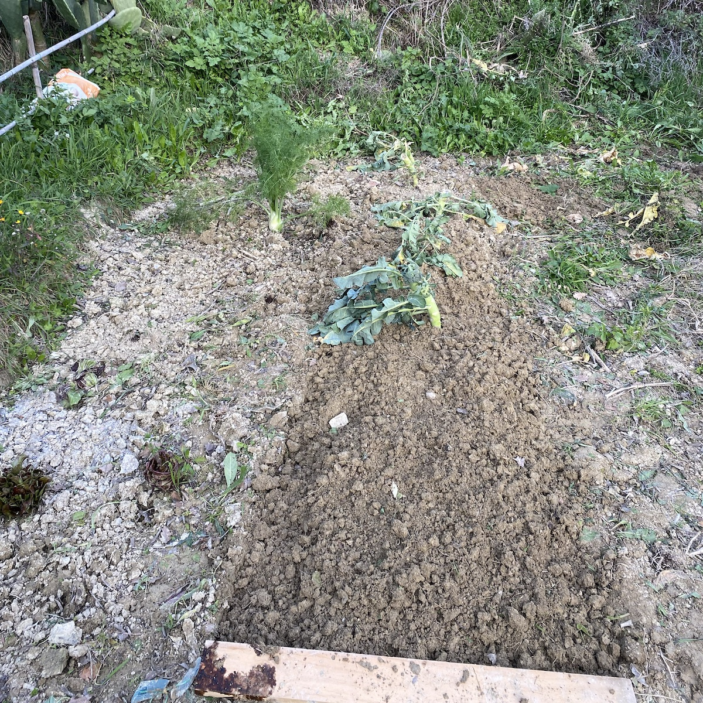

Yesterday was a perfect early spring day; clear blue skies, warm sunshine. Off to the countryside to visit my friend Bill and help him with his vegetable garden, and while I was doing that I had ample time to think once again about the differences between Italian and British approaches to gardens and, especially, growing food.

===

In the Italian countryside, everyone with a bit of land usually also has an _orto_ for vegetables. It is often squeezed in among the olive trees and moves here and there from year to year. Preparation generally consists of little more than taking a rotavator to the ground. Even where the orto stays in the same place each year, there’s a point in early spring when anything remaining is abandoned and the whole plot is rotavated, often up and down the slope rather than across the contours. My experience is limited, I know, but mostly there doesn’t seem to be much of an idea of crop rotation. Equally, there’s not much interest in weed control beyond yanking out or lopping off a particularly large specimen. Maybe some growers do top-dress and mulch, but it isn’t common.

If you’re a gardener in the Anglo-Saxon tradition, you can maybe see where this is going. Rotavating a spot where perennial weeds are growing is a sure-fire way to multiply the problem, every little bit of chopped up root tending to sprout into a new individual. The soil is often dominated by clay, and people tend to walk wherever they choose, so as the summer wears on it gets harder and harder, making any kind of weeding impossible.

So it was with Bill’s orto and a week or so ago, on a visit, I was pointing out some these things, which I do see as less than optimal. Call me when it’s rained, I said, and I’ll come up and help. It rained last weekend, so there I was.

Tools embody another set of cultural differences. Because the soil is clay, I imagine, Italians do not seem to use English style spades and forks. Pointy shovels yes, but no forks. And what they call a hoe is what I call a mattock, a sturdy blade on the end of a handle for chopping down into the clay, rather than something for lightly skimming along the surface among the growing vegetables.

So there I was, faced with perennial-infested and very sticky clay, my only weapon a hand trowel. In the end, in about five hours, I managed to roughly delineate two beds across the slope. Along the way I rescued a few brassica stumps that had been uprooted prior to the grand rotavation and replanted them to sprout again. You can always remove them when you need the space, I explained, suggesting too that it might be a good idea to sow a couple of rows of fava beans on either side of the stumps, which I hope will improve the clay just a bit. I think I persuaded Bill to consider walking only on the unweeded “paths” and I suggested he not rotavate this year and see if he could both compost his own waste and, maybe, try to get some extra from his green-minded commune to spread on the soil.

I’m absolutely knackered, aching all over, and also absolutely delighted to have spent a day in the sunshine with my hands in the soil. And I hope to return in a couple of weeks to do some more work and continue proselytising.
