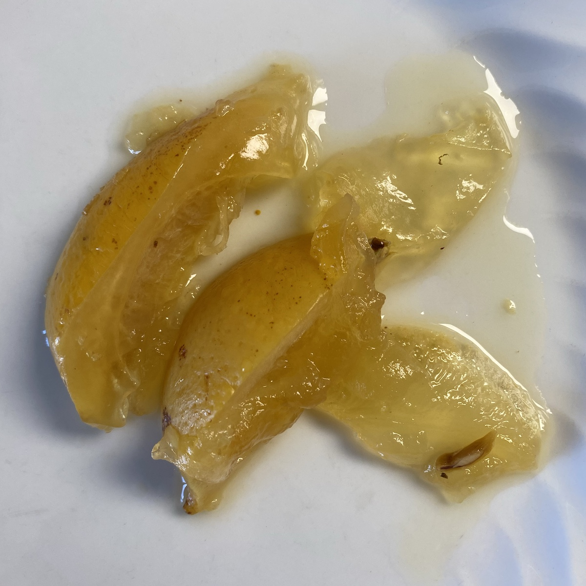

A couple of days ago I tackled some salt-preserved lemons I had made about a year ago, just my terrace-grown lemons and salt. I had failed to notice that the air-trap fell out some time ago and the top layers, where more oxygen was available, had played host to a grey-green mould that had turned the lemon wedges to mush. Beneath that, though, all was well, so after I removed as much of the mush as I could I started decanting the preserved lemons into a clean jar. They were fine, but as I delved deeper, I noticed that many of the wedges were encased in a kind of gel. It was not nearly as tough as the scoby you get in, say, vinegar or kombucha but it had a great deal more presence than the delicate slime or mucus of kefir.

{.u-photo}
<figcaption style="font-style: italic;">You can see the firmer gel clinging to the lemon</figcaption>

I tasted a bit, and it was quite pleasant, like the lemons quite salty and with a good sour kick, but I had no idea whether it could be used for anything at all, so I scraped it off as best as I could and consigned it to the compost. Naturally I did some research to see what I could discover, and the answer was, nothing. The index to Sandor Katz’s _The Art of Fermentation_ contains not a word on gels or polysaccharides. The academic literature turned up only how to get microbes to produce or ferment polysaccharides. My limited search-fu did uncover a single instance of [someone who had observed the same](https://cooking.stackexchange.com/questions/112767/how-does-preserved-lemons-salt-soultion-form-a-gel), the answers to which suggested that the gel might not have been a microbial product at all.

I remain somewhat mystified — and would appreciate any suggestions — but I’m glad the lemons are as good as ever.