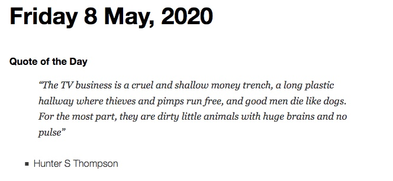
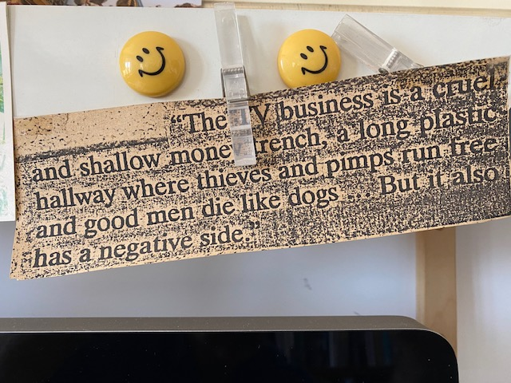

I don't know where [John Naughton](https://web.archive.org/web/20200511110338/https://memex.naughtons.org/friday-8-may-2020/29641/) found his version of this quote from Hunter S. Thompson:

{.center} 

I do know that the version I photocopied more than 25 years ago and that sits above my desk to this day, is more Gonzo.

{.center} 

But that's also a secondary source. [This](https://www.liveabout.com/where-thieves-and-pimps-run-free-3299166) is as close to truth as one can get. But now I want to know. Who did add the kicker?
