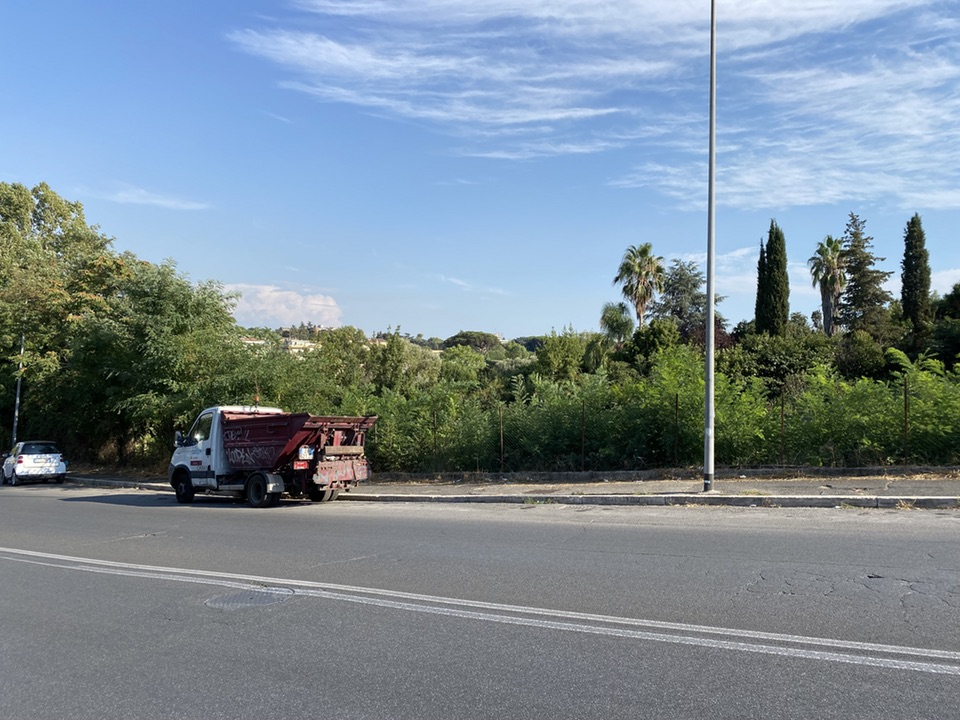
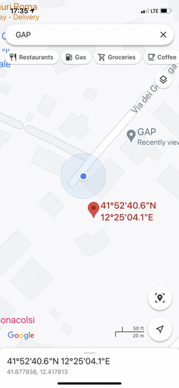
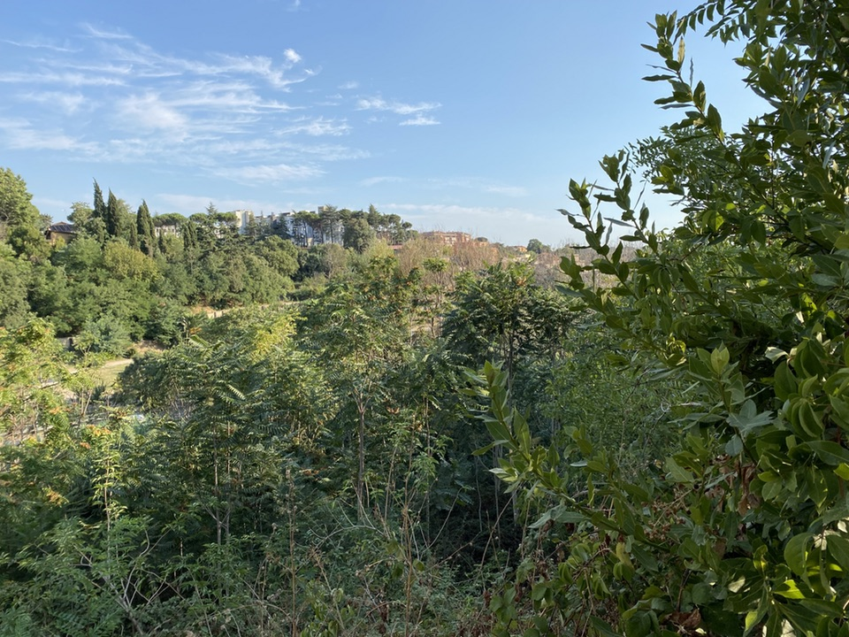

I bagged another geohash yesterday. All it took was rescheduling and redirecting my normal walk, because the target location was just over 5 km from my home. How often does that happen? I [wrote it up on the wiki](https://geohashing.site/geohashing/2021-09-06_41_12), to the best of my ability, but adhering to IndieWeb principles I’m hosting my own suitably edited version here.

===

## Expedition

It was a nice enough urban walk, though not much of an expedition as I know many of the streets on the way there quite well. I decided to stop and take a photograph at every kilometre because they reveal something about Rome. Most notably, although this area outside the centre is very built up with large apartments, there are also fingers of green that penetrate deep into the city. The picture at km1 shows one of those, which used to have an illegal vegetable growing area on it when I first lived nearby. There is no sign of that any more. It is a huge pity that there are so many unkempt areas that could so easily be used as spaces where people could grow food.

{.center}

Another thing you can see in some of the pictures (on the wiki) is how completely cars occupy the streets. In many places they are parked on both sides of the street up against the walls of the buildings, forcing you to walk in the road. The density of housing, often with very inadequate parking, and the fact that car ownership is very high, make Rome a horrible city for urban walking. The parks are good, but much of the green space is inaccessible.

In the neighbourhood of the target, most of the buildings are large, ugly apartment blocks, almost all of them built since the 1960s or 70s. Very occasionally there is a relic of a much older building, which back then must have been surrounded by open land. Now they look hemmed in and unloved, like a decaying tooth.

{.left}

At the closest point I was about 20 metres from the actual target, but there was no way to access it both because it is on private land and because it is on the side of a very steep valley. Did I reach it? I'm not sure. How close do you need to get? If I didn't, it was because of both Mother Nature and Private Land.

{.center}

No way I was going to clamber through that.

