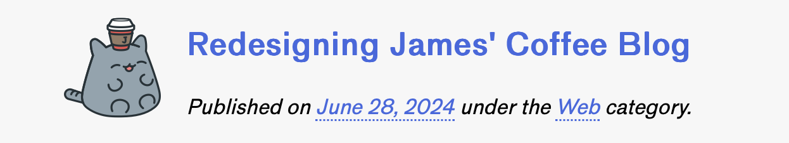
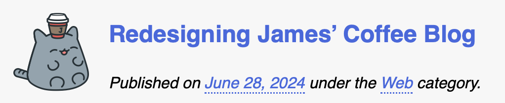

 This started a few days ago when [JamesG announced the redesign of his website](https://jamesg.blog/2024/06/28/new-design/). The design and the thinking behind it are great. There was just one thing about it that grated with me: a “straight” quote, right there in the title.[^1]

{.center}

===

I’ve been a stickler for typographic quotes — single and double — since forever,[^2] so naturally I just had to stick my oar in, screenshot the result and send it to James.

{.center}

There followed a pleasant discussion among various deniszens of the IndieWeb about the difficulty of using typographic quotes, which may well be something to do with the fact that they were not originally part of ASCII so they were never sensibly on keyboards. Matthew Butterick, in his [eminently sensible advice on the topic](https://practicaltypography.com/straight-and-curly-quotes.html), says that like many bad habits of digital typography they were originally bad habits of typewriters. No argument.

The chat culminated with a [wiki page](https://indieweb.org/curly_quotes) and a general request to add relevant examples. In the discussion, I mentioned my own solution and made a mental not to add it later. The next thing I know, JamesG is hosting this month’s [IndieWeb Carnival on the subject of tools](https://jamesg.blog/2024/07/01/indieweb-carnival-tools/). Perfect. I write about my Quotes tool, submit it to the carnival and add it to the Wiki. Trifecta!

## Smart tool
In the normal run of things I can generally remember the Mac keyboard combinations for curly single and double quotes and Byword, my scrivening software of choice, has an option to enable Smart (i.e. typographic) quotes and dashes. The problem with that is that it can play havoc with my writing workflow, because the CMS I use sets certain things by means of a frontmatter block of YAML, which absolutely requires straight quotes. Defaulting to typographic quotes inevitably messed up when I edited something in the frontmatter.

A couple of years ago I must have been more than usually fed up having to correct a mess of my own making. I asked around and, after a bit of futzing, the result was a Python script that converts single and double straight quotes and double dashes to their typographic equivalents. [I run it from Alfred](https://www.jeremycherfas.net/blog/converting-straight-quotes-with-alfred) but feel free to download the script and use it however you wish. I should note that it might not be as perfect as Butterick might wish. It preserves spaces around em dashes (because that’s how I type them) and it doesn’t attempt en dashes, because typing those by hand is second nature.

## Delightful
Yes, this tool is a delight, every time I use it, which is every time I write something. Select the text, hit two keys in succession, job done. Yes, I have to remember not to include the four hyphens I use to indicate a horizontal rule in Markdown and likewise to exclude code snippets, where straight quotes are essential. Overall, it is a joy, and I made it myself, with a little freely-offered help, which is what the IndieWeb is all about. 

! This post is a submission to [Tools](https://jamesg.blog/2024/07/01/indieweb-carnival-tools/), hosted by JamesG for the [IndieWeb Carnival](https://indieweb.org/indieweb-carnival). There may be others, not as geeky.

[^1]: I just checked, and it is still there, so I went to Archive the page, only to discover it had been excluded from the archive. So I screenshotted it.

[^2]: I learned to copy edit on hot-metal galleys, that how long ago forever was.