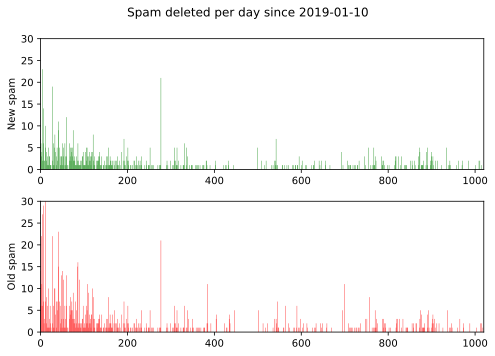

For three years now I have kept track of the spam I have had to deal with at my stream of micro-posts. No more. I will still be keeping track, but there is no need to keep updating the sparkline I used to have in the sidebar. Instead, I will leave you with this final picture, which I may update in a year's time.

