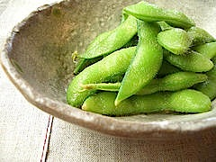

{.left} Soybean news [^fn1] from all over. [Tom Philpott at Gristmill]~~http://gristmill.grist.org/story/2008/4/22/12524/8050~~ links to two newspaper articles that report studies showing a difference in yield between GM and non-GM soybeans. Unlike [Anastasia at Genetic Maize](https://web.archive.org/web/20090426001540/http://www.geneticmaize.com/2008/04/exposed/), I have not gone back to the original papers to dissect them as she has, so I’m not going to be dogmatic. I am, however, going to say that there are many ways of measuring benefit, of which pure yield is only one, but I do think that if GM crops were as clearly superior as they are claimed to be then there wouldn’t be nearly as much scope for claims and counterclaims. I know that’s the way science is done, and I’m also deeply skeptical that much of the GM debate even faintly resembles real science.

I don’t read Spanish, either, but I don't think one needs to be totally fluent to get the gist of a recent article in SciDev.net, [Maleza invade soja transgénica en Paraguay]~~http://www.scidev.net/en/agriculture-and-environment/paraguay-gm-soya-invaded-by-weed.html~~. A glyphosate-resistant selection of _Digitaria insularis_, a nasty weed also known as sourgrass, has made itself felt somewhere in Paraguay’s 2.6 million hectares of GM soybeans. There’s no citation to original research, but the announcement came from Alfredo Molinas, Paraguay’s minister of agriculture, and given that Paraguay is pretty gung-ho for GM soybeans I doubt that he has an anti-GM axe to grind.

Again, I draw no vastly important conclusion. Exert widespread and unremitting selection pressure and it is no great shock to find organisms showing signs of adaptation. You don’t have to have GM to do it, but it helps.

And finally, Patrick of [Bifurcated Carrots](http://www.patnsteph.net/weblog/) thinks I’m being [a bit harsh](https://jeremycherfas.net/blog/just-say-no/) when I suggest that farmers just say “No” to GM crops like soybeans.

> [D]on’t forget what put the small farms out of business in the first place. Companies like Monsanto, seed laws like we have in Europe, government subsidies and farming policy, exclusive markets and middlemen, and so on. These things still exist.

True, but not entirely. European seed laws didn’t put US farmers out of business. Nor I expect, did Monsanto. Treating soil like dirt and food as widgets did for many small farms, who had to grow or get out. But Patrick’s list is unhelpfully inclusive.

> If a group of farmers got together and did what you suggested with unprotected soybeans, the only place they could sell them would be a roadside farmer’s market stall. No middleman or wholesaler would touch them. Monsanto would be there insisting they prove the beans didn’t have any of their genes, under threat of a lawsuit. They would have administrative problems with USDA officials, subsidies and so on.

Again, I fear that list is too large. Nobody’s going to buy soybeans from a roadside market stall, unless they’re after [edamame](https://en.wikipedia.org/wiki/Edamame) . My feeling, as I indicated, is that wholesalers would indeed be interested in buying a guaranteed non-GM harvest. Monsanto’s threats could be faced down if the farmers were confident that their seeds did not contain patented genes, and the USDA (unlike European seed cops) would probably leave them alone. Of course, we’ll never know. Maybe I’m just too optimistic for my own good.

> There is just very little a small group of farmers could do by themselves.

It’s easy for me to say that there is actually a lot small farmers could do for themselves, and as easy for Patrick to say the opposite. Neither of us really knows. I don’t have any specific examples I can point to either. I do know that suitably motivated individuals can make a difference; Bob Palmer of [Upper Ninevah Farm](https://web.archive.org/web/20080509091601/http://ww2.netnitco.net/users/djligda/wbengld.htm) in England has a herd of [water buffalo](https://web.archive.org/web/20071012200312/http://www.waitrose.com/food/celebritiesandarticles/producers/9907084.aspx) that prove nothing except that nothing (“Literary” license. Nit-picking will be ignored.) is impossible.

[^fn1]: Flickr photograph by [Kanko*](https://www.flickr.com/photos/kankan/33346213/) used under a Creative commons license. 

!!! 2022-05-05: So many dead links, on a topic so many people thought was so important. It just goes to show …
