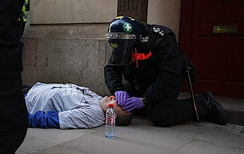

I know I’m late to the party, [^fn1] but I have only now watched [Gordon Brown’s surprise talk](https://www.ted.com/talks/gordon_brown.html) at Ted Global in Oxford. It was a magnificent performance, but that’s all it was: a performance. He started with a harrowing set of images, from the napalmed child in Vietnam via the vulture waiting for a Sudanese girl to die to the Iranian woman killed during a demonstration after the stolen elections. Where possible he gave them names -- which I’m deliberately not doing -- to further increase our compassion and build common bonds of shared humanity etc. etc.

One name he did not mention was that of [Ian Tomlinson](https://www.guardian.co.uk/uk/2009/aug/06/ian-tomlinson-family-accuse-police-of-cover-up). One picture he did not show was this one: [^fn2]

{.center}

Or this one, of a police paramedic attending to Mr Tomlinson after he collapsed. [^fn3]

{.center}

Brown was making the point that sharing images via the internet can help mobilise global change. He mentioned four different areas for which, he said, new global institutions were very much needed. Watch Gordon’s performance by all means, and agree with him, if you like, that we do indeed need new, globally relevant approaches to development, finance and climate change.

That's three. I left out “security”. Why? [Watch some of the videos here](https://www.guardian.co.uk/uk/video/2009/apr/08/g20-police-assault-ian-tomlinson-video), that show how Mr Brown approaches security in his own country.

Thou hypocrite, first cast out the beam out of thine own eye; and then shalt thou see clearly to cast out the mote out of thy brother's eye.

[^fn1]: And I did have a quick Google to see who else was saying what. There wasn't much, although this (~~http://www.kijo.co.uk/technology/scientists-celebrities-internet-gurus-oh-and-gordon-brown-bump-brains-at-ted~~) is as entertaining an account of Ted as you're likely to find anywhere.  *2021-08-12*: Alas dead, and unarchived anywhere I can find.

[^fn2]: Copyright The Guardian 

[^fn3]: A Getty image, from The Daily Mirror. 
