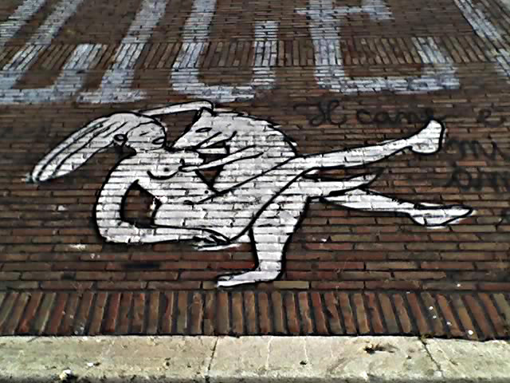
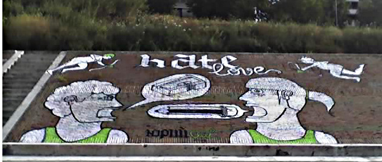

Down by the river this morning, a faint sweet whiff of aerosol spray paint alerted me that the Great Artist had been in action. Two pieces on the embankment. In the first, see below, a new twist on an old theme:

{.center}

To one side, in Italian, obviously: _Il cane è il migliore amico della donna_. The dog is woman’s best friend.

On the other side of the stairs, a larger work, possibly more cryptic, definitely harder to render with a little cameraphone. 

{.center}

Once again, an age-old theme, hate and love. He seems to be thinking ”pencil sharpener” while she seems to respond ”Pencil”. Cherubs look on. The palette is restricted, but forthright. The underlying motivation, unclear.

The really Big Question is how was it done? The slope is pretty steep, too steep to walk easily up and down. I suspect an accomplice with a rope was involved. Fine start to the day.
