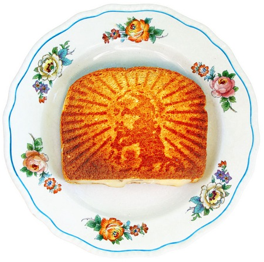

{.center}

[From Rob Corso and Meg Sheehan](https://laughingsquid.com/grilled-cheesus-sandwich-press-imprints-image-of-jesus-on-bread/): now if they could make it with interchangeable imprinting elements, they’d be onto a global sure-fire winner.
