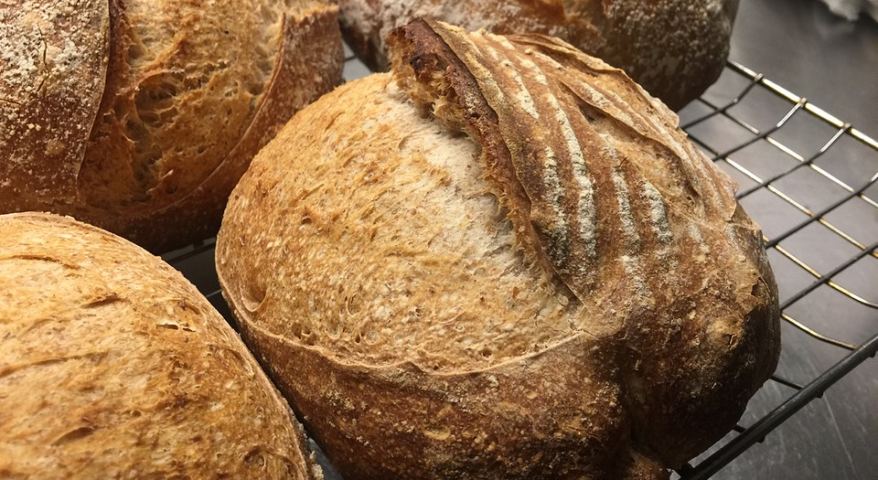

This morning [I read in The Guardian](https://www.theguardian.com/media/2020/apr/08/influencers-being-key-distributors-of-coronavirus-fake-news) that “Celebrities and politicians with large social media followings are proving to be key distributors of disinformation relating to coronavirus”. That well-known epidemiologist Woody Harrelson is among those blaming 5G network masts for coronavirus.

> Research by Oxford’s Reuters Institute for the study of journalism found that while politicians, celebrities and other prominent public figures were responsible for producing or spreading 20% of false claims about coronavirus, their posts accounted for 69% of total social media engagement.

And yet, right there is the self same Guardian, is coronavirus-adjacent misinformation from Guardian columnist Adrian Chiles: [I have finally mastered the dark art of sourdough baking. Here's how to do it](https://www.theguardian.com/commentisfree/2020/apr/08/coronavirus-crisis-loaf-bread-sourdough-bake-off-flour-yeast-lockdown). OK, I can cut Mr Chiles some slack for his fast-and-loose history; a hack has to meet their word count. But I must correct three bits of egregious misinformation.

===

Keeping a sourdough going does not involve “discarding most of it every few days”. It can, if you’re a wasteful, privileged ninny, but it doesn’t have to. As a few of us have been telling the no-yeast noobs, [you can keep less than 20 grams very handily in the fridge](https://www.fornacalia.com/2020/the-starter-leaven-pipeline/) and just bring it out and feed it the day before you are due to bake. I doubt that I have discarded more than about 50 g of starter over the past 12 months.

Another benefit of keeping a small amount of starter is that you can then safely ignore another of Mr Chiles’ “key principles”. If you bring the starter out of the fridge to build your leaven, you will be assured that it is good and lively and ready to work.

Finally, while you certainly can “do the baking in a lidded pot, just big enough to accommodate the loaf” you do not have to. A nice heavy casserole or Dutch oven may improve your bread, and I often use one, but it is by no means essential. You can bake excellent bread without one. You can also bake excellent bread in a tin, if you prefer.

So much for real misinformation. I also take issue with the statement that “the making of the starter, over five days, is simple enough”. That is pretty misleading. It usually takes more than five days to get a decent starter going, and impatience is the downfall of many a beginner. I reckon it takes about 10 days to get a really good starter from scratch. And rather than discard any excess starter as you wait (or, indeed, at any point in the future) just mix it up with a bit of oil and a pinch of salt and fix yourself a sourdough pancake.
