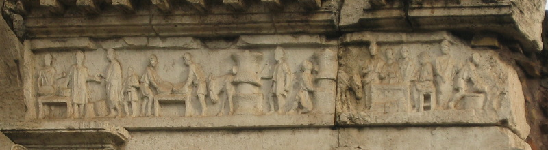
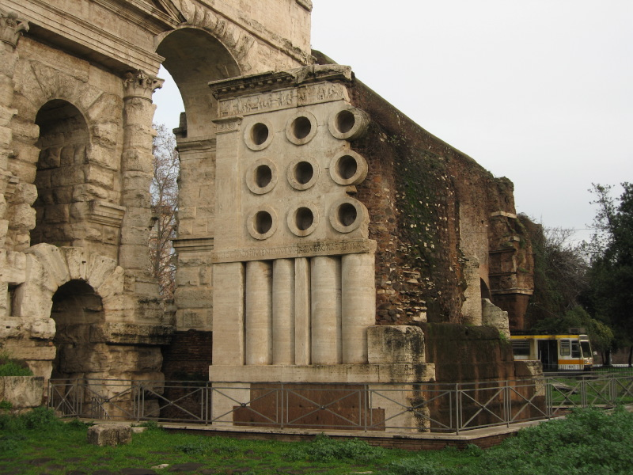

_Originally published on 17 February 2010, not much has changed, so I'll just give it a new date. And link to my offering: [Cornbread for Fornacalia](http://www.fornacalia.com/2017/cornbread-for-fornacalia/)_

{.center} 

I can't actually be sure that today is the day, because the [Curio Maximus](https://en.wikipedia.org/wiki/Curio_maximus) hasn't actually announced it. But today is the last day it could possibly be. So I'm celebrating in the simplest possible way, by baking bread with only three ingredients: flour, water and salt. Oh, and the squillions of things that bestir my 100% hydration natural leaven.

{.center}

It would be nice to know more about the [Fornacalia](http://en.wikipedia.org/wiki/Fornacalia) than the little I gleaned from Wikipedia in English. Still, better than the [Italian](http://it.wikipedia.org/wiki/Fornacalia). And then there are the supremely puzzling links between [Fornax](http://en.wikipedia.org/wiki/Fornax_%28mythology%29), Goddess of the Oven, [^fn1] [fornices](http://ancienthistory.about.com/library/bl/bl_prostitutionnotes2.htm#Fornix), where one could hire a hot babe, [fornices](http://en.wikipedia.org/wiki/Fornix) cerebral and otherwise, and [fornication](http://web.archive.org/web/20081104002314/http://sacred-sex.org/terminology/fornication). [^fn2] Not to mention buns in ovens. The modern constellation [Fornax](http://en.wikipedia.org/wiki/Fornax) is clearly of little relevance. One could, however, clearly spend a lifetime exploring these particular rabbit holes.

[^fn1]: Don't trust this Wikipedia entry for the date of Fornacalia.

[^fn2]: Praise be to the Wayback Machine at [archive.org](http://archive.org/web/) for preserving old web pages. Don't trust Wikipedia on this etymology either. 