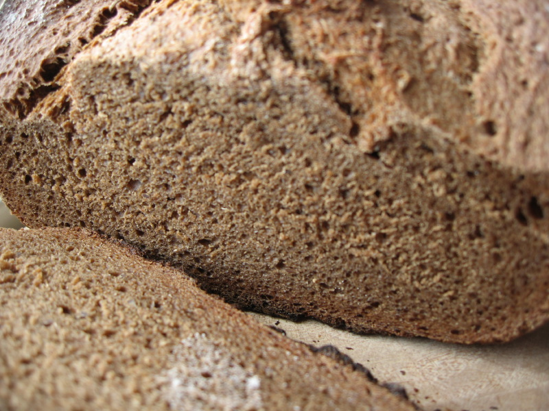

Much of the bread you can buy in shops in Italy remains remarkably good. Some things, though, aren't available, at least not nearby. One of those is rye bread. So I resolved to make some this weekend, using a recipe for Heidelberg Rye from the 1973 edition of Bernard Clayton Jr's The Complete Book of Breads.

Conclusion: A fine loaf, but I do need to internalise that stuff about watching the loaf not the clock. If I can do it while the bread is in the oven, why not while it is rising?

===

The first task was to convert Clayton's volume measurements to weights. Time consuming but worthwhile. My strong (Manitoba) flour averages 140 gm a (8 oz.) cup, the rye a little lighter, but I decided to use the same conversion factor. So here's the list of ingredients with my conversions.

  
  1. 420 gm All-purpose or bread flour (3 cups) I actually used 345 gm, allowing for the flour in the starter.
  2. 420 gm rye flour (3 cups) I used 100% rye, stoneground, biological, Demeter brand.
  3. 2 packages dried yeast. I used 150 gm of my sourdough starter, freshly fed at 100% hydration, based on an approximation of 10% starter.
  4. 20 gm cocoa (1/4 cup)
  5. 1 tablespoon each salt and sugar (Didn't weigh. Used 15 ml measure, demerara sugar and fine table salt).
  6. 1 tablespoon caraway seeds. (Small Italian dictionaries give _comino_ for both cumin and caraway. The real thing is _carvi_.)
  7. 480 ml hot tap water (2 cups). Bizarrely, my 1 cup measure is marked 250 ml, but contains 240 gm of water. I actually used 405 gm, allowing 75 gm from the 150 gm of starter.
  8. 100 gm molasses (1/3 cup)
  9. 2 tablespoons shortening. I used peanut oil.

Clayton says to mix half the flour with all the other ingredients for about 3 minutes "until the dough is a soft mass and is no longer wet and sticky". Got there using a wooden spoon, but it is a stiff dough even with only half the flour, and a pretty exhausting three minutes it was. Then adding the flours, white and rye, in 70 gm lots, trying to stir them in. After about 210 gm I switched to the spatula to cut the flour into the dough, and when I had about 70 gm of rye left I turned the dough out onto a wooden board to knead.

Slowly I worked the rest of the rye into the dough, kneading all the while, for about 8 minutes. Clayton says "finally it will become a soft velvety dough, a delight to work". That's possibly stretching it a bit (haha) but it did become soft, not sticky and OK to work, but it didn't have the elasticity of a pure wheat dough. Maybe that's because I used whole rye.

Now here's where things went off track. Clayton says to cover the dough and let it rest on the work surface for 20 minutes before shaping the loaves. I did, but it changed not one whit. He doesn't give any indication of doubling or anything in this recipe, not at this stage nor for the shaped loaves, and so I thought it best to leave the dough resting until it had at least risen somewhat. In the end, even after 3 hours at 29°C, it was very hard to see any movement at all, but my timetable required me to shape the loaves -- one round and one long one that I put in a parchment-paper loaf tin. Then into the fridge they went, brushed with olive oil and loosely covered with a plastic bag.

This morning I did as Clayton suggests, heating the oven to 400°F (Gas Mark 6 on my oven) and bringing the loaves out of the fridge 10 minutes before they were to go in. Slashed them with a wet ceramic knife, and in they went.

I resisted the temptation to peek for the full 30 minutes, as advised, and when I did I was very pleasantly surprised by how well they had sprung. Too much, in fact, clear evidence of under-development, I think. Clayton says check after 30 minutes for that elusive "hard and hollow sound". I prefer a thermometer, and mine barely reached 150°F. I gave it another 10 minutes, then another, then a third, which was perhaps five minutes too long as the internal temperature had somehow climbed to just above 200°F. Out of the oven, onto the rack, and ready for their close-up.[^1]

{.center}

Three hours later, lunchtime, and time to cut. Great smell of caraway, good fine crumb, moist, a hint of chocolate (which gives the lie to Clayton's claim that "the chocolate's contribution to taste is so slight as to go unnoticed) and a very definite molasses sweetness. All in all, a great success. A tad too sweet for my normal taste, although I think the molasses flavour is really good. I wonder, might it be a good idea to get rid of the tablespoon of sugar -- I mean what is it going to offer to the dough that 100 gm of molasses doesn't? The cocoa? I like the rich dark colour, but if it can barely be tasted, what's the point? And finally, it might be better if the dough sat in an oiled bowl, rather than on the counter, until it had doubled, or at least risen noticeably?

All good thoughts, which I may try when I repeat the recipe. I'll also be looking for a good caraway-rich light Jewish rye. And I think I'll see whether [YeastSpotting](http://www.wildyeastblog.com/category/yeastspotting/) might be interested in this. If I had nothing else to do all day, and a horde to feed, I'd be baking everything there.

[^1]: There's an album of photos at [flickr](https://www.flickr.com/photos/jcherfas/albums/72157622142208887/with/3892830394/)
