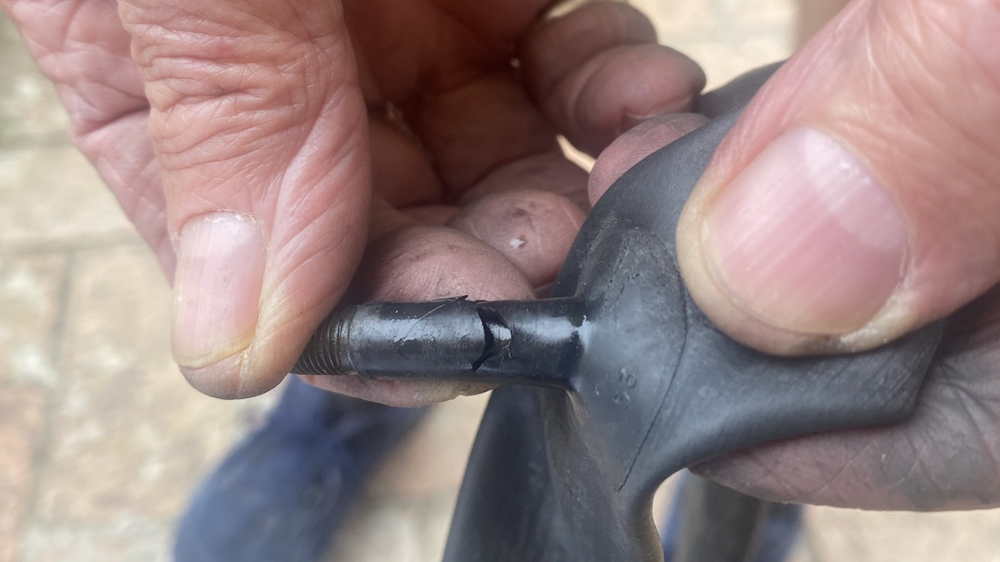
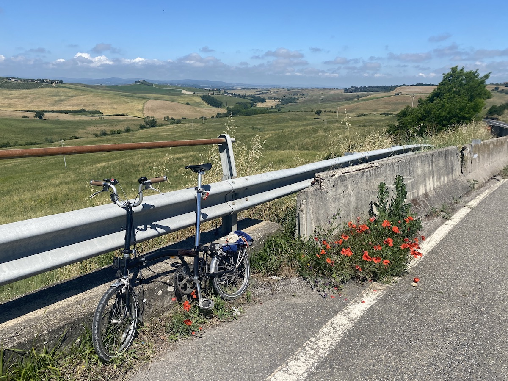
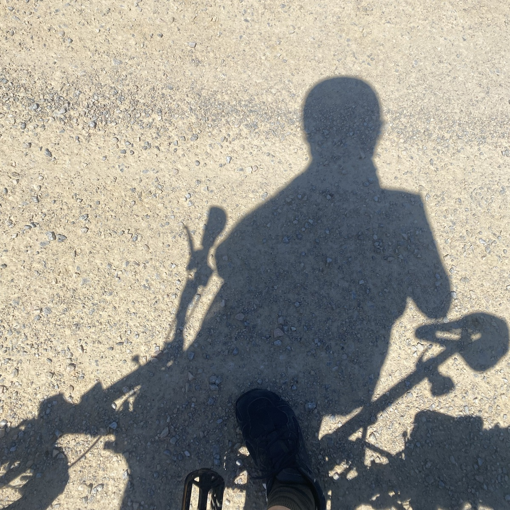
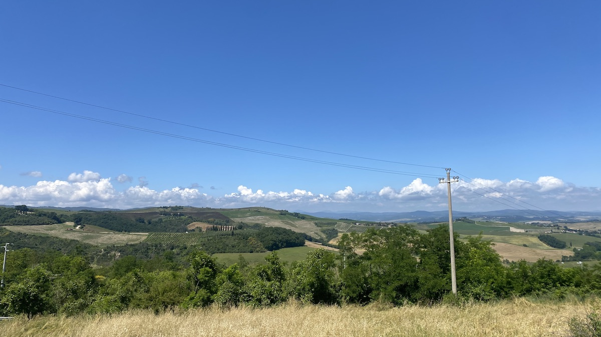

⏱️ 02:49&nbsp;&nbsp;&nbsp;⇄33.7km&nbsp;&nbsp;&nbsp;⌀11.6km/h&nbsp;&nbsp;&nbsp;↗357m&nbsp;&nbsp;&nbsp;↘363m

The [Eroica](https://en.wikipedia.org/wiki/L%27Eroica) is a bicycle ride dedicated to vintage bicycles (pre-1987) and held in Tuscany on the first Sunday in October. I have known about it for a while, and encountered it accidentally last year. This year, back near Buonconvento with The Squeeze, I packed the Brompton thinking I might, at the very least, go for a little pedal. Then on Tuesday, when I saw that the formal Eroica passed right below the place where we are staying, I decided to do a bit more than that, which I did yesterday.

——

Using Komoot to look at possible rides, my first thought was to go to Montalcino but the elevation profile scared me. A little town called Torrenieri seemed more manageable. I unfolded the bike and immediately encountered a completely flat tyre, front, thankfully. A quick pump had no impact whatsoever, unsurprisingly given that when I extracted the tube it seemed that the valve stem was somehow broken completely.[^1] Luckily I had a spare and a tyre glider and an electric pump, so I was on my way without too much delay.

Riding white roads, as they’re known here, is no joke on the Brompton. The surface is generally compacted gravel with varying amounts of loose stuff. Heavy tractor traffic causes corrugations that can shake your kidneys loose. And there are the usual dips, gullies and potholes to avoid and cope with. It isn’t easy, but it is fun, in an exhilarating way. 

In Buonconvento the roads are reasonable and they took me to the Via Cassia, which runs all the way to Rome; of course it does. The Cassia was beautifully smooth, revealing just how much effort it takes to overcome the rolling resistance of gravel.

[{.center}](route-lg.jpeg)

I was on the Cassia for almost 9km and aside from the glorious surface the other lovely thing was the respect that every driver showed me, passing wide. Not once did I feel threatened, and this is a busy main road. Of course, they are all used to packs of road cyclists here, so they take the occasional madman on a folding bike in their stride, but it was still nice. The climb started after about 2km and was fairly gentle to begin with, but the final climb gained 100m in about 2km, which may not be much if you’re wearing Lycra, but left me hot, sweaty and out of breath, despite stopping briefly to look back the way I had come.

Torrenieri was nice enough; quiet, with a steady stream of cyclists passing through. I stopped to refuel and rest at a patisserie that had a crostata of dried fruit and nuts embedded in something like dolce de leche designed, it seemed, to give knackered cyclists a jolt of sugar. Certainly three gravelistas also wolfed down a slice. 

Emboldened by the crostata, I asked Komoot to take me back a different way, along the white road that is part of the Francigena pilgrims’ trail and that a previous cyclist had highlighted as “nice up and down gravel”. It was nice although, as previously noted, also tense and exhilarating. And though it was mostly down there were a few ups on which I just ground to a halt. No shame in pushing the bike to the top.

A steady stream of cyclists and walkers came at me, and we exchanged a cheery “Salve!” and continued on our way. Eventually the white road encountered the road between Buonconvento and Montalcino that had scared me originally, and I was delighted to mostly coast down it to the white road that would take me from Buonconvento back to The Squeeze.

During this final section, especially, I had time to reflect on the foolishness of riding small wheels on gravel. At no point could I simply relax and let the pedalling take me over. Unevenness that a 26-inch wheel would barely notice is enough to give the Brompton a severe jolt and pose a risk of skidding sideways on loose stones. The short wheelbase also contributes to a general skittishness. So while the climb up the Cassia was exhausting, riding gravel drained me to a completely different level. Still, I am very glad I tried and yes, I am thinking about a carrier so that I can bring a different bike up here next time. Maybe even the vintage Raleigh.

## Technical note

Komoot is great for planning rides, especially with a screen bigger than a phone’s. The whole heroic excursion actually consisted of three tours, as Komoot calls them, but I could find no way in Komoot to assemble them into one. Very grateful, then, that I can download GPX files of each from Komoot and hand them off to [GPX Studio](https://gpx.studio) to do the assembly, which it does brilliantly. It also provides a quasi-heatmap on the elevation profile, which I found entertaining. I’m not sure how it does that; average speed is average, with fast (green and  pale green) and slow (red and pale red) some sort of deviation from average? Regardless, I like that even though I would actually prefer to see a heat map of velocity superimposed on the route.

[^1]: No idea how that happened. Possibly something else in the bike bag bashed it.
