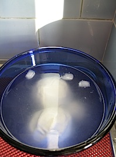
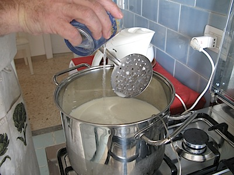
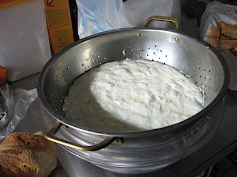
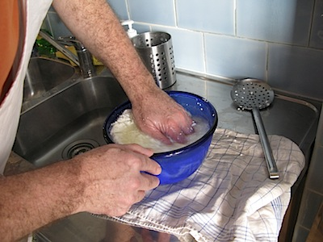
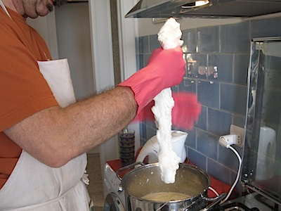
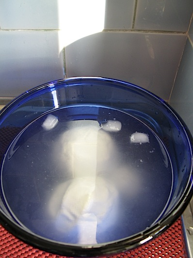
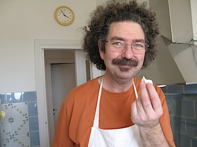

{.left} Just a couple of mozzarella balls,[^fn1] nothing much to blog about. Except for one tiny thing: I made them! At home! And it is all Barbara Kingsolver’s fault.

I may have [given the impression](https://agro.biodiver.se/2009/01/where-do-your-garden-seeds-come-from/) that her book *Animal, Vegetable, Miracle* is not very good. That would be wrong. It has its faults, no doubt, but it is very good; passionate, funny, informative and, in this case, inspirational. It inspired me to make cheese.

That has always been a little passion of mine, something I really wanted to try. Before I came to Italy, the problem was that a [really wonderful pioneer cheesemaker](https://www.saveur.com/article/Travels/Mrs-Kirkham-Had-a-Farm/) lived just across the hill. So why bother making my own when his [Caerphilly](https://www.thecheeseshed.com/products/cheese/not-cheddar/item/ducketts-caerphilly) was there for the asking? And when I got to Italy, great cheese was even closer to hand. Besides, people in small apartments don’t make cheese.

Barbara Kingsolver’s recipe for quick mozzarella changed that. She made it seem so easy. All I needed was a bit of rennet, _caglio_ in Italian. None to be had. Quick emails back and forth with Kingsolver’s [cheesemaking muse](https://www.cheesemaking.com/) took me back to Somerset, and [Moorlands](https://www.cheesemaking.co.uk/), (Brilliantly simple and functional site, by the way.) who mailed me a small bottle of the stuff, animal, if you please, by choice.[^fn2]

Yesterday afternoon we set out to do the business, and it was wonderful fun. I checked a couple of other web sites for instructions, especially for the variants that do not require a microwave, and off we went.

{.center}

That’s the rennet going in above. It’s odd having no real idea of how things should be, only descriptions and other peoples’ photos. So I wasn’t sure at any stage whether it was going properly. At least the milk curdled beautifully into curds and whey shortly after the rennet went in.

{.center}

{.center}

Cutting the curd and transferring it to a smaller bowl to press out the whey went smoothly too, but the cheese was nothing like mozzarella yet. That’s because it has to melt first, and be worked, kneaded and stretched like dough (which I do understand) to give it the smooth shiny skin and slightly stringy texture. And this is the bit where a little more research, or a microwave, would have come in handy. I balled the curd up before returning it to the pot of whey, so it took a long time to get to the right temperature. With a microwave, you can just blast it.

{.center}

The right temperature is about 80°C, and believe me, that's hot! Hence the fetching pink Marigolds. I’d love to know how the real artisans manage this step. Anyway, a little working, pulling, stretching, reforming, and the stuff really did begin to resemble something a bit like mozzarella. Finally, into a bowl of iced water, with a little whey and salt.

{.center}

Of course I removed a small piece for immediate gratification. And boy, was it gratifying.

{.center}

It tasted like real mozzarella. I was kind of flabbergasted. So was The Squeeze. “Holy Crap,” I thought. “It worked.” I spent much of the rest of the day wearing a stupid grin and feeling inordinately proud of our efforts.

Today, preparing this post, I spent even more time surfing in search of insights, and all I can say is that I’m glad I didn’t find them ([start here](https://fankhauserblog.wordpress.com/cheese-making-for-new-folks/)) yesterday morning. I’m sure they would have put me off. As it is, I’m going to use them to improve my technique.

So, just one question remains. If the _alimentari Pugliese_ around the corner has such great cheeses, so simply obtained, why bother? I can’t answer that. Because I can?

[^fn1]: All photos by The Squeeze, world’s best sous-chef, among other things. 

[^fn2]: Don't get me started on the knitted muesli types and how they manage to square ”vegetarian rennet” with their other lifestyle choices. 
