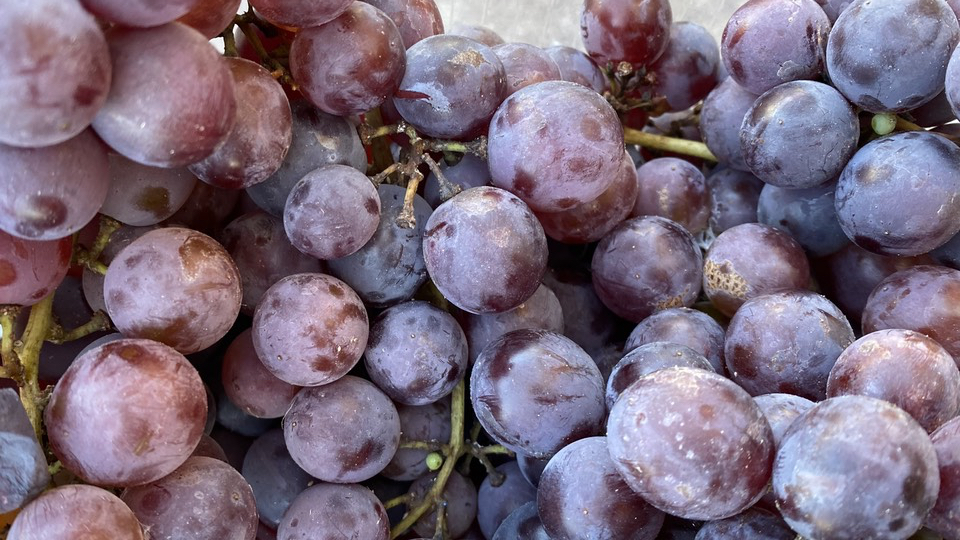
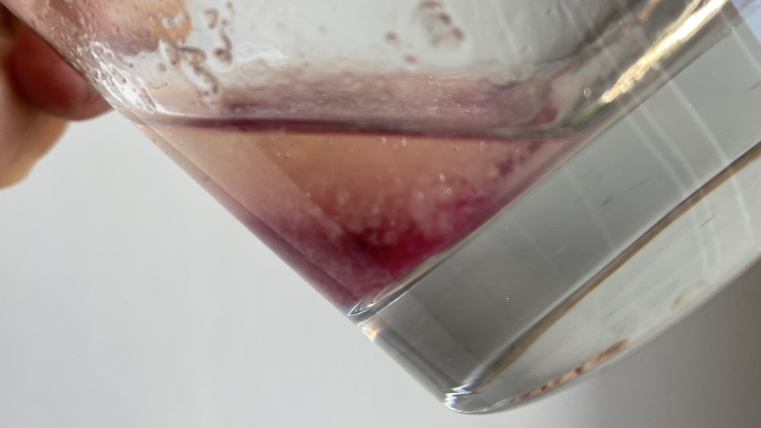
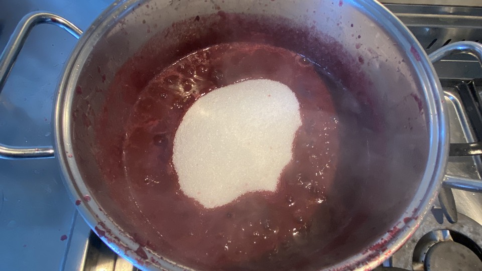
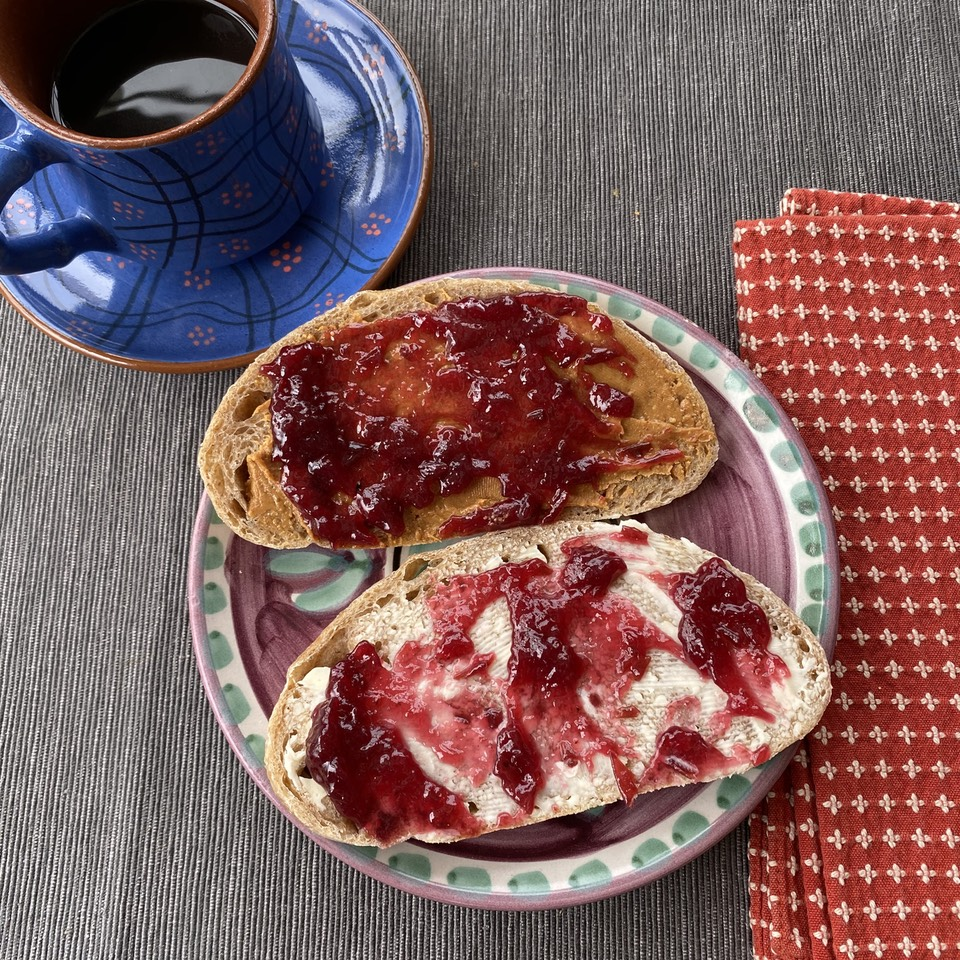

What kind of stupidity is “8 cups of grapes”? Squished in? Lattice packed? How big is each grape?

[{.center}](grapes-1920.jpg)

This was the lunacy that faced me on Saturday as I started to research homemade grape jelly. I moved rapidly along from that one, aside from lingering doubts about why it included one teaspoon of butter, and whether I should do the same. Italian recipes, for jam, not jelly, were not much more helpful, with amount of sugar ranging from 600 gm to 240 gm per kg of grapes.

===

In the end, I went with the crazy American method and the solid advice on quantities in the indispensable _Home Preservation of Fruit and Vegetables_ from the late lamented AFRC Institute of Food Research. I have the 14th edition, published by HMSO in 1989.

All this started a couple of weeks ago when I read something about Concord grapes being the grapes behind the most iconic of grape jellies (and juice?). Of course I failed to make a note, because I had no intention of making grape jelly. But then I remembered that the grapes Italians call *uva fragola* are Concord-type grapes. Indeed, Italians sometimes call them *uva Americana*, because that is where they come from. 

Many people adore them, but I can’t really detect any of the strawberry flavour that gives them their Italian name. In any case, the tough, poppable skin and plentiful seeds reduce their appeal, and if I want to taste strawberries in my fruit, I’ll eat strawberries.

Still, the idea of grape jelly lodged itself in my brain so on Saturday morning, when I spotted a couple of large punnets of *uva fragola* at the street market, I snapped them up.

I set to, adopting the method of the absurdist recipe for [Concord Grape Jam](https://www.seriouseats.com/recipes/2011/09/concord-grape-jam-recipe-grape-jelly.html), popping the pulp out of the skin and saving both. A mindless, meditative task that took around 45 minutes and left me with one bowl full of pulp and seeds and another full of grape skins. Roughly 1 kg of grapes produced 460 gm of wet skins and 1070 gm of grapes.

Phase 2a involved pulverising the skins with an immersion blender and about 60 ml of water, then simmering for about 10 minutes.

Phase 2b was to simmer the pulp for 10 minutes until the flesh was soft enough to push through a sieve, which I did, leaving all those pips behind. Now came the tricky part; how much sugar?

I had 700 ml of pure juice. The book advised that a goodly concentration of pectin would set 575 gm of sugar to 600 ml of juice. I was disappointed when a pectin test with the juice (5 ml of juice in 15 ml of pure alcohol or methylated spirits) gave a very weak result. How could that be when grapes, especially Concord varieties, are universally touted as high-pectin fruits? Then I remembered that pectin is most present in the skins. Bingo, a solid clot (though it is a bit hard to see in the photo) promising plentiful pectin. So, 670 gm of sugar for my 700 ml of juice (ignoring the roughly 350 ml of pulped skins).

[{.center}](clot-1920.jpg)

The book had some good advice about boiling down the juice to get rid of some of the water before adding the sugar, which helps it to reach the setting point quickly so that the pectin is not inactivated by heat. Another quick set of calculations gave me a target weight for the saucepan full of juice and pulp and when I hit that, in went the sugar.

[{.center}](sugar-1920.jpg)

It didn't take long to reach a rolling boil and, after about 5 minutes, the desired temperature of 105°C (221°F). Into the waiting warmed jars and there it was: three 250 ml jars, one 125 ml jar and a little bit extra to eat at Sunday breakfast.

[{.center}](bread-1920.jpg)

I’m tempted, now, to have another go at the quince jelly I made a while back that resolutely refused to set.

In summary, then:

- Pop the grape pulp from the skins, saving both.
- Blend the grape skins with about 60 ml water, bring to a boil and simmer for 10 minutes.
- Bring the pulp to a boil and simmer for 10-12 minutes, until soft enough to push through a sieve.
- Push the pulp and juice through a sieve into a measuring jug.
- Weigh 575 gm of sugar for every 600 ml of pulp and juice.
- Place the juice and softened skins in a saucepan, weigh, and if necessary boil until weight has been reduced by required amount.[^1]
- Add sugar and juice of ½ a lemon.
- Bring to a rolling boil until temperature reaches 105°C (221°F).
- Bottle in clean, pre-warmed jars.
- 1 kg of fruit yields about 900 ml of jam.

[^1]: The actual calculation is a bit complex. The book says:  
“weight of jelly = weight of sugar × 10 ÷ 6  
The combined weight of sugar and juice should be about 225 gm more than the weight of jelly. If it is significantly more than that, then boil the juice to reduce it until the required weight is reached.”
