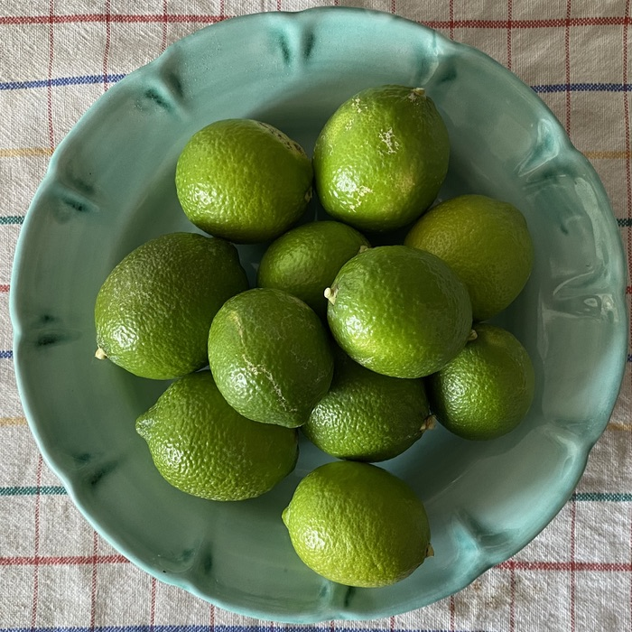
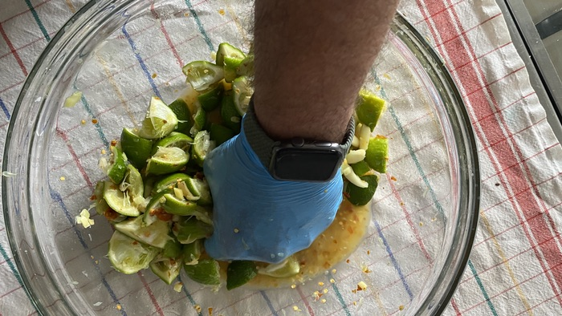
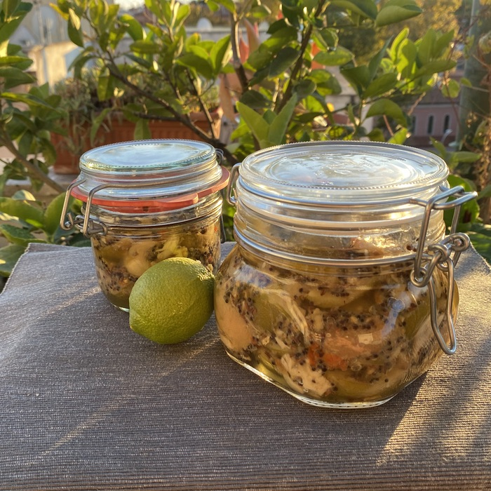

Long ago and far away, the Memsahib of the time, who had grown up on the hills of Mumbai, had a slim, battered cookbook. Sometimes, on a dark and damp afternoon, sat in front of the stove, we would read from the brittle pages, and one recipe has always stayed with me.

“Fill an earthenware pot with limes, salted and seasoned, and leave in the sun for 40 days.”

===

[{.center}](limes.jpg)

So when, this year, the little lime tree on the terrace produced what passes here for a bumper crop, my thoughts turned naturally to lime pickle. I searched diligently, and found [a recipe that seemed to offer the needful](https://greatcurryrecipes.net/2011/04/29/indian-lime-pickle-recipe/). One tiny problem was that the recipe called for 1 kg of limes, but my little lime tree had provided only 700 gm. No matter, I can do the maths.

[{.center}](squishing.jpg)

The entire process is very simple. I wore gloves because I really do not want lime juice getting into any little nicks and scratches on my hands. It didn’t seem to make any difference.

Out into the sun which, naturally, chose that day and most of the next to sulk behind the clouds. Not a llot of point photographing a bunch of limes and garlic sitiing in a jar, not least because I didn’t have the recipe’s required “2 tbsp Kashmiri chilli powder - Or another and to taste”. I used about 2 tablespoons of our standard little red _peperoncini_, and although I gound them up as best as I could, they didn’t impart quite as much flaming colour to the pickle.

That ”to taste” by the way; seems silly to me. I mean, how are you supposed to know whether you have too much or too little until the entire process is finished?

[{.center, u-featured}](jars.jpg)

And when it was finished, after frying the seeds and mixing with oil and spending another two or three days out in the sun, I did taste, and it was good. Now it sits in the back of the fridge for a little longer, until I have an occasion to cook up an Indian.
