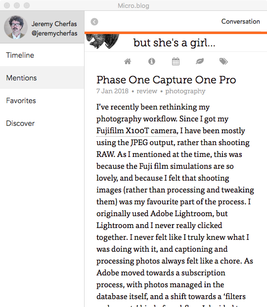

{.center}

I've had some odd things happen on micro.blog lately, to whit <a class="u-in-reply-to" href="https://stream.jeremycherfas.net/2018/im-not-sure-i-want-links-to-open-in-microapp" >links opening within the micro.blog app</a >. To confirm I'm not nuts, I grabbed a screenshot, but when I attempted to create a reply at my Known install, Known refuses to upload the image. This is nothing new, but I had forgotten wabout it and it hasn't been enough of a problem to devote any energy to. At least, not so far.

So, this post exists in an attempt to get the screen grab into the conversation at micro.blog.

While I was about it, I also fancied that perhaps my OS X micro app might be out of date, so I checked on that, and got another odd error.

{.center} 

The thing is, micro.blog **is** in my Applications folder, so I'm none the wiser. Is Version 1.0b11 (12) up to date?