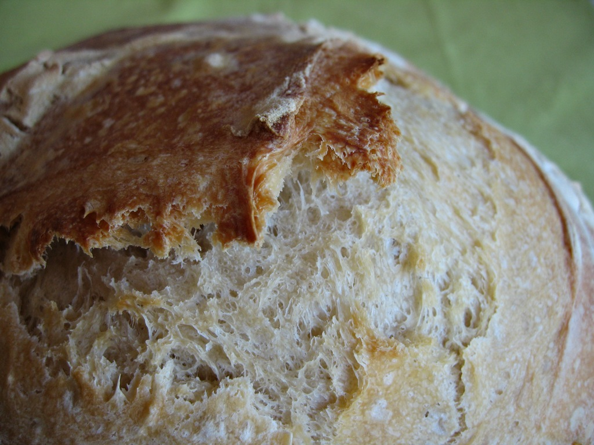

Tunneling hither and yon through the internets I have been learning more and more about sourdough fermentation and why [my bread hasn’t been too pretty](aesthetic-disaster-taste-triumph/) of late. Advice suggested that I feed the starter with strong flour, reduce the amount of starter to 10% and slow the whole process down by using the fridge to retard temperatures. So, to hell with one variable at a time, that’s what I did. The big question is when to retard. A spreadsheet I found suggested that at fridge temperature (4℃) the bulk fermentation would take 115 hours and the proof of the loaves 41 hours. A tad too slow. Predicted figures for room temperature (30℃) were 4.4 hours and 1.5 hours. Too fast. The consensus seems to be that retarding shaped loaves is best, and that one can bake them from cold.

In the end I allowed a little more than 3 hours for bulk fermentation, folding in the bowl for 20 strokes every 30 minutes. I shaped one ball and one tin; I wanted a loaf as a gift and if the boule had failed a tin would have been a good second best. Shaping the boule was interesting and promising, as it clearly had more of a structure and formed a good taut skin as I worked the dough under itself. Into the basket, into a plastic bag and into the fridge, with no time at room temperature.

Next morning once the oven was hot I upended the basket over a tray, and was somewhat alarmed that the dough spread out quite a lot. Nevertheless, with the tin in reserve, I sprayed lightly with water, attempted to score the loaf, and got it into a hot oven above a pan of steaming water. Peeking 20 minutes later I got a pleasant surprise: oven spring. Reduced the temperature, gave it another 20 minutes and then left it to cool.

{.center}

You can see that the tin loaf -- baked under a hot cast iron casserole -- actually exploded more than somewhat, and that the scoring of the boule was not very effective. Overall, though, I’d have to admit to being quite pleased.

{.center}

I didn’t get the obligatory crumb shot -- the loaf was too busy being eaten, and it seemed churlish to interrupt a lunch with friends for a photo op -- but the crust is pretty.

Lessons for next time: give the shaped loaf a little time, maybe an hour, at room temperature. Score more resolutely. Er ... that’s it.
