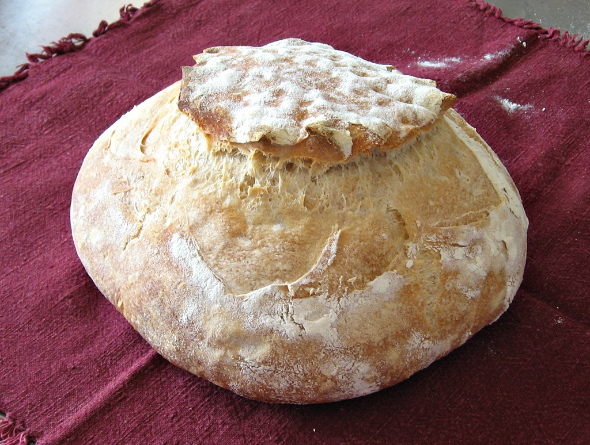
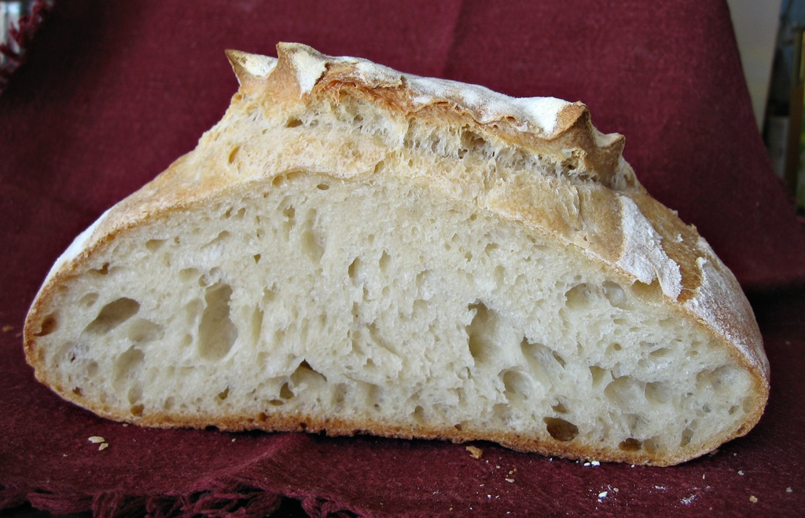

First off, 2000 words.

{.center}

{.center}

The complete story. With all the great help I've had at The Fresh Loaf, I managed a pretty good hot weather sourdough loaf [last time](https://jeremycherfas.net/blog/hot-weather-sourdough-almost-there/). My notes then suggested giving the shaped loaves longer at room temperature and scoring more resolutely, and so at the first possible opportunity, that's what I resolved to do.

I made a dough at 60% hydration based on 500 gm of strong flour, using 50 gm (10%) of active bubbling starter at 100% hydration. I stirred roughly to mix and then let it hydrolyse for an hour while I walked the dog. Then, rather than folding in the bowl, I dusted off my silicone mat and did the stretch and fold on that, two stretch and folds every 30 minutes, returning to the bowl inbetween time. It is remarkable how the structure builds for really minimal effort.

After about three and a half hours bulk fermentation I shaped the dough into a tight ball and put it in the basket lined with a floured tea-towel and left it out at room temperature (30℃) for an hour while I walked the dog again. Then into a bag and into the fridge overnight.

About 8 hours later, with the oven fully hot, I tipped the loaf onto a tray and, rather than score it, snipped it with scissors. Into a steaming oven for 20 minutes, and I was amazed at the rise. Another 20 minutes slightly cooler and then 10 minutes with the oven off and the door ajar.

A minor triumph. I’m pretty sure that the time in the fridge won’t make all that much difference, at least not if it is say an hour or two more. Less might be a problem. So if I know I can bake the next morning, this offers a good way to get a loaf done, starting late afternoon the night before. What if I can’t bake till evening? We shall see.

In the meantime, I do now know what happens if you increase the hydration to 65% and do not retard the dough at all in the fridge: the loaf spreads and barely springs. But I’m sure it’ll taste good later tonight.
