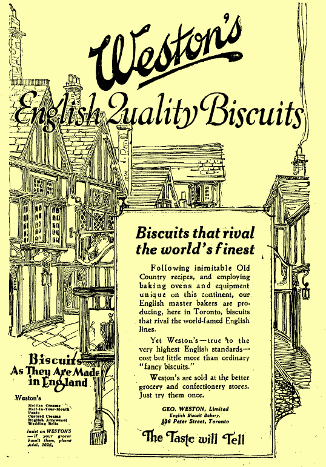

! On this morning's walk, during which I was going over this article in my mind, my podcast player threw up the latest episode of The Food Programme from the BBC, [about bread](https://www.bbc.co.uk/programmes/b09vz6r3). Or rather, about Nathan Myhrvold and Modernist Bread. What a great episode it was, a marvellous example of how to showcase an interview with judicious clips, subtle scoring and some good contributions from Dan Saladino, the producer. Now to find the recipe for chocolate cherry sourdough.

The Food Programme's recent episode on bread pivoted, quite rightly, around the year 1961, when the new Chorleywood Bread Process thrust tasteless pap on an all-too-willing public shopping for convenience. And for this year's Real Bread Week, [Chris Young at the Sustainable Food Trust](http://sustainablefoodtrust.org/articles/first-it-was-fake-farms-now-fake-bakeries/) dug into the devious lengths to which at least one supermarket is now going to suggest that their bread is anything other than industrial. What was Tesco's own-brand "everyday value" white sliced loaf is now marketed under the brand name H.W. Nevill. That name, [Tesco tells us](https://www.tesco.com/groceries/en-GB/products/299045558) dates back to 1872, when "Henry William Nevill founded his first bakery and started a proud baking tradition. Almost 150 years later, our hero bakers take their craft just as seriously as Henry did". Leaving aside all the tosh about hero bakers and craft, Chris Young looked at the history of H.W. Nevill and discovered that it hasn't baked a loaf of bread since the 1960s, when it was swallowed by Sunblest. Sunblest is currently owned by [Associated British Foods plc](https://en.wikipedia.org/wiki/Associated_British_Foods), and ABF became the name of Allied Bakeries Ltd in 1960, just before the introduction of the Chorleywood process.

Still with me, I hope.

My interview with Di Murrell about how grain moved by barge around the Thames basin should have contained a chapter that ties these apparently disparate threads together, but there wasn't room. For a couple of years, Di and her husband Tam carried weekly loads of grain by barge to Coxes Mill at Weybridge in Surrey. Coxes has a long history, and in her book Di shows how it can be thought of as a symbol of the history of bread in England. Coxes was an independent miller until, like H.W. Nevill, it was bought by Allied Mills, part of ABF. It is the history of Allied Mills that Di Murrell tells in *Barges & Bread*.

Allied Mills sprang from the loins of George Weston, a Canadian apprenticed to a Toronto baker at the age of 12. Six years later, in 1882, he bought a bread route from his employer and went into business for himself. He prospered, bought out his former master and developed his loaf of Real Home-Made Bread, using the finest Manitoba wheat and local Ontario wheat in about equal proportions. On he went, investing in automation and expanding his range until by the start of the 20th century he was Canada's biggest baker. George's son Garfield served in World War I and returned to Canada with the bright idea of manufacturing the best-selling biscuits that he had seen in England. 

{.center} 

Weston's English Quality Biscuits launched in 1922 and Garfield took over Weston in 1924 after the death of his father. The company went from strength to strength, buying up small bakeries, consolidating and modernising right through the Depression. During the depression, Garfield Weston could see that Canadian wheat farmers were suffering and came up with a cracking idea. Maybe he could increase demand for Canadian wheat by opening a chain of bakeries in the UK. He did, and they did well too, but even though his bakeries were able to make a better loaf with Canadian wheat, other bakers weren't convinced. Garfield Weston's solution was to import the wheat himself, mill it, and make his flour available to British bakers. He created Food Investments Ltd in 1935, almost immediately changed its name to Allied Bakeries and began to buy up small independent millers.

Generally Weston left these small family mills alone, managed by the families that had previously owned them, but now supplying them with Canadian wheat. The resulting high-protein flour went to Allied's bakeries, and others, where it made good, profitable loaves, and by the start of World War II Allied was Britain's biggest baker. Garfield went into politics, helped to feed Londoners during the war, and in 1945 returned to Canada. 

In 1960 Allied Bakeries became Associated British Foods. In 1961, bakeries fell with glee upon the Chorleywood bread process, perfected by the British Baking Industries Research Association. It's actually very hard to find anything about the BBIRA[^1] but if it was an industry supported association, I find it hard to believe that Britain's biggest baker was not also the BBIRA's biggest supporter. In 2018 ABF still produces much of the bread in Britain, including the stuff that pretends it was crafted by the hero bakers of H.W. Nevill.

The really strange part in all this is that Garfield Weston came to Britain with [two stated ambitions](http://www.weston.ca/PDF/GWL_History_Britains_Biggest_Baker.pdf):

> “I want to give the public the best quality bread that can be produced ... I hope at the same time to increase the demand for Canadian wheat, which is the best in the world, as you know, and which makes a better bread than any other.”

Instead, through Allied and ABF, he gave us bread made from weaker, cheaper flour at lower cost. And we ate it up.

Syndicated from <a class="u-url u-uid" href="https://www.eatthispodcast.com/how-great-canadian-wheat-ruined-industrial-bread/" >Eat This Podcast</a >.

[^1]: Now amalgamated with the Research Association of British Flour Millers to form the Flour Milling and Baking Research Association, which is effectively invisible on the internet.
