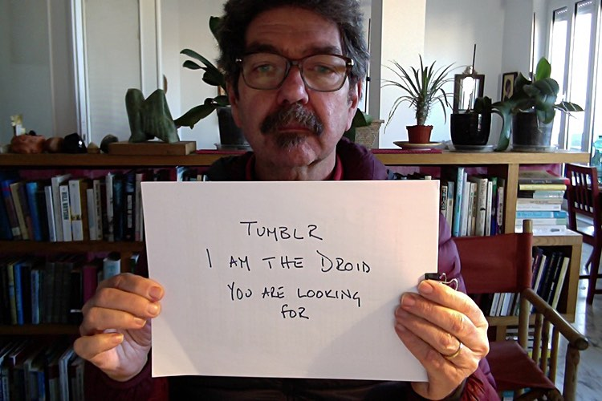

I like being able to put things up here on the internet, not just to feed my ego but also because I genuinely think other people may find them just a teeny bit diverting. Lord knows, it is easy enough to do that, what with all the options out there that make sharing banalities just a click away. The problem with most of those for me, however, is that I want to be the customer, not the product. I actually want to pay for the services I use. Lately, though, that hasn't been working out too well.

Before I get to that, though, I want to complain about one of those free services, one where I didn't actually mind being the product: Tumblr.

===

 {.center} 

I liked [my Tumblog](http://loafman.tumblr.com/). It threw up all sorts of interesting things that I might never otherwise have seen, and it enabled me to bung stuff up without too much effort that nevertheless looked reasonably presentable. Then last summer my mobile phone supplier threw a massive wobbly, unresolved to this day, which prompted me to walk away and get a new number from a new supplier. In the meantime, what with one thing and another, I hadn't logged in to Tumblr for an age, and of course, like any good nerd, I had enabled two-factor authentication, so when I did want to log in Tumblr dutifully asked me to enter the code sent to my mobile device.

##Can you see where this is going?

I emailed explaining the situation. After a bit of prodding, Tumblr sent me a bizarre set of hoops to jump through, which included sending them a copy of the photo you see above along with a link to some other "verified" photo of me. And because I did actually want back in, I took the stupid photograph, linked to another stupid photograph of myself, and waited. No dice. They couldn't confirm that we were one and the same person and that that person "owned" my Tumblog. 

A bit of me thinks that the whole thing is some gigantic prank, along the lines of "I wonder what idiotic thing we can persuade people to do," and that the walls of Tumblr Central are papered with printouts of fools like me, for the lulz.

Anyway, the Tumblog itself stumbles on in an undead lurch, fed an occasional bit of brain thanks to an automaton I set up in happier times. And the fact is, I wouldn't mind getting back in, for all sorts of reasons. The Merry Pranksters at Tumblr Central suggested I abandon the old one and just start again, which is sort of tempting, I have to say, but I'm not quite ready to do that.

Which brings me right round to the whole sensible online platform thing again. A while ago I switched this website [from WordPress to Octopress](https://www.jeremycherfas.net/blog/im-a-baker-not-a-fryer). I enjoyed it, but the truth is that there's just too much friction involved. I tried, and failed, to use Octopress while travelling. I tried, and failed, to lubricate the friction away. I tried, and failed, to force myself to address the problems. All of which explains why this site too, like my Tumblog, stutters on without actually having the good grace to die.

So what do I want? I'm not even sure any more. I got fed up nannying my WordPress installation, so no nannying. I want to be able to publish from any device, anywhere. I'd like to be able to make it look good, again without too much nannying. I'd even pay. Maybe I should revisit Squarespace; at $8 a month, it might just do everything I want.

Nah, that's failure talking. There has to be a better way.

P.s. 3 January 2016: And there is a better way; you're looking at it. [Grav](http://getgrav.org)
