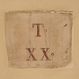

{.left} There’s a struggle each morning. Walkers and cars, each trying to dominate the other. It probably started when Romulus told Remus not to jump over his wall.

“Stuff that, I’ll jump over anything I like.”  
“Right. Then I’ll have to kill you.”

There’s just no respect. Drivers disrespect pedestrians. Pedestrians disrespect drivers. The result really is a doggy dog world, and yet nobody seems to see anything wrong with that. That’s how we are, they say, as if there were no possibility of being any other way. Density-dependent selection aside, it drives me nuts.

Photograph by [me](https://flickr.com/photos/jcherfas/sets/72157604302482813/)!
