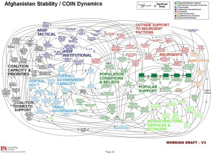

> There is a fundamental rule I follow: more complex the concept, the simpler the graphics; conversely, the simpler the concept, the more fun you can have with the graphics. 

There really isn't a lot more to say; nevertheless, I suggest you go and [read how Thomas P.M. Barnett would have approached this thing](https://thomaspmbarnett.com/globlogization/2010/4/30/the-infamous-ppt-slide-much-ado-about-tmi-being-presented.html), which you might also want to click to enlarge and thus enjoy in its full glory:

[{.center}](article-0-09562375000005DC-283_964x699.jpg)
