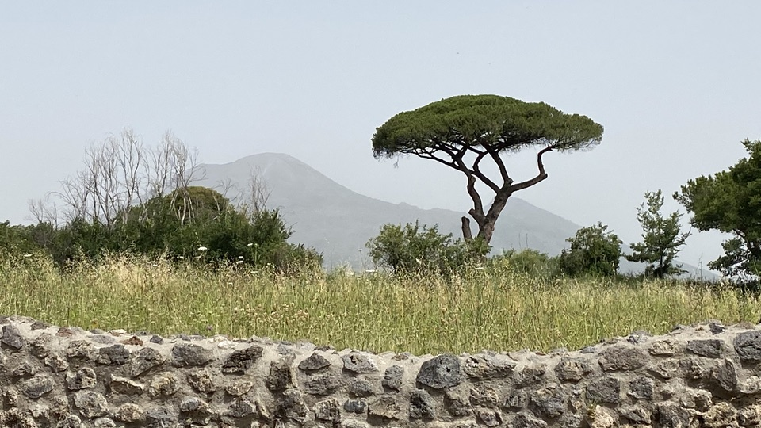
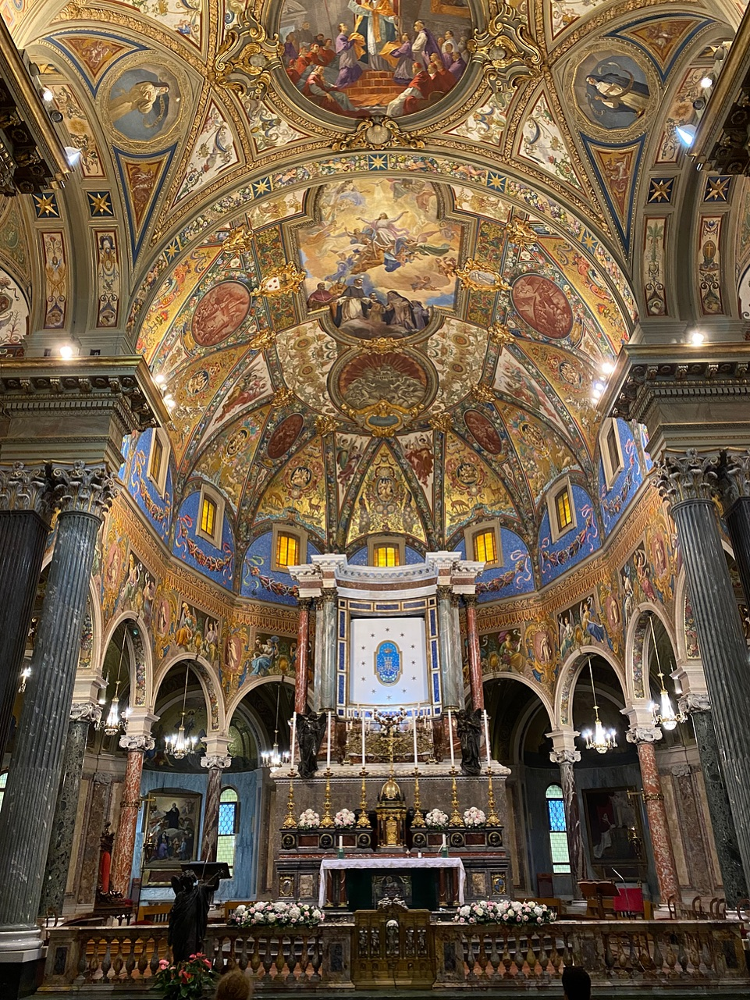
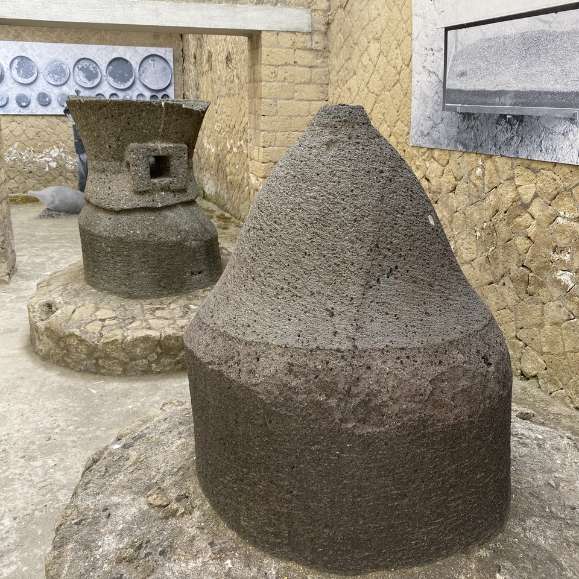
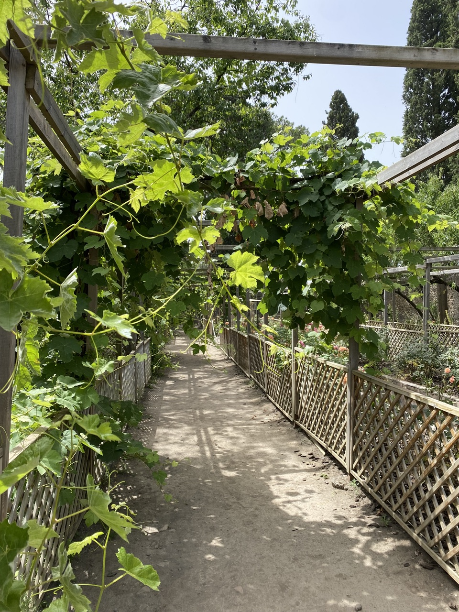
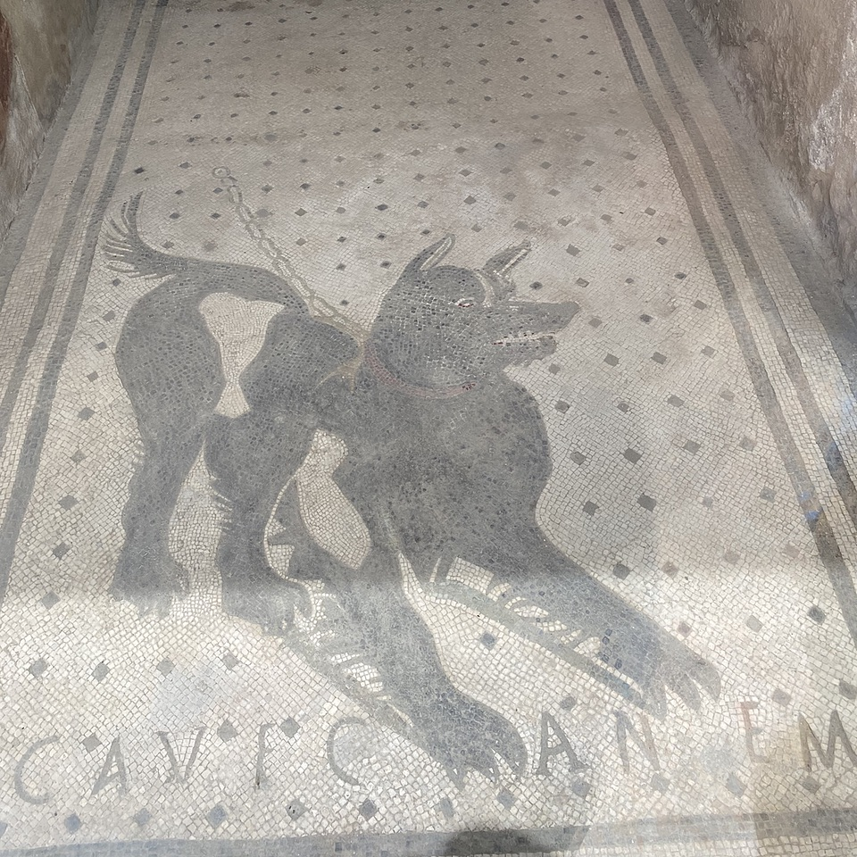
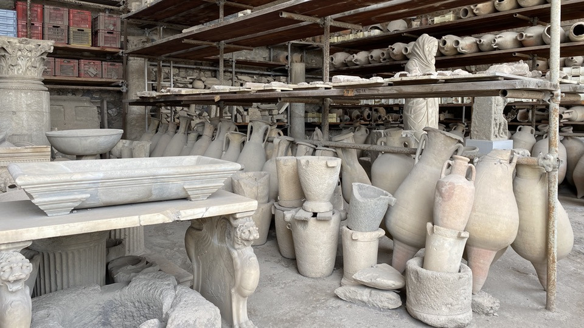
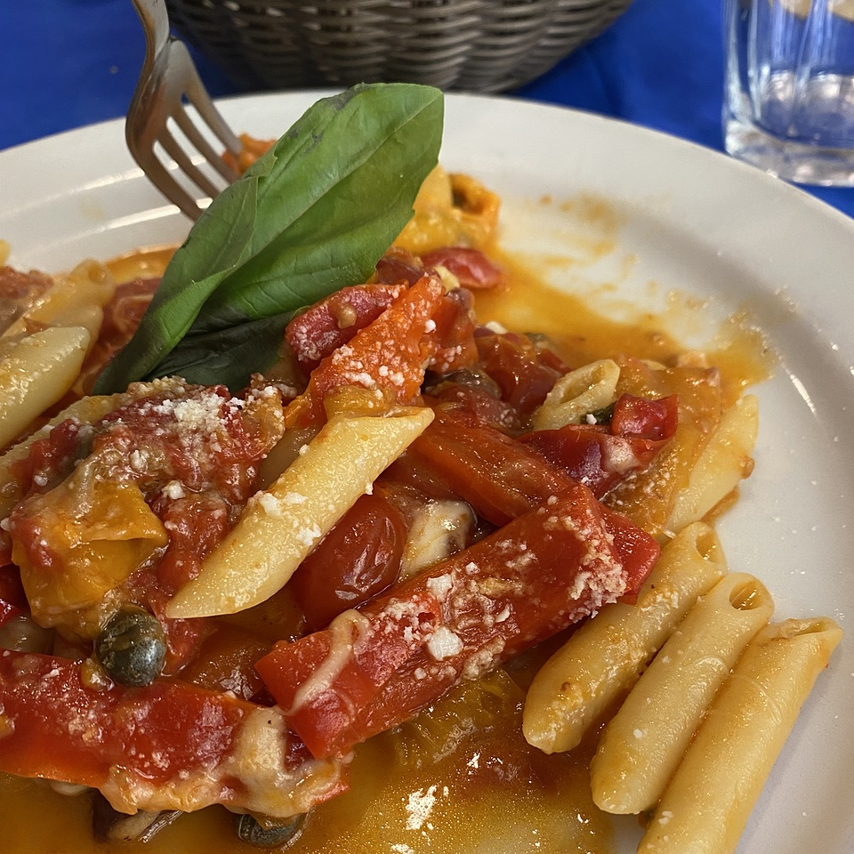

{.center} 

Plenty of places will tell you why you should visit Pompei (and Herculaneum), what you should look out for, and what it all signifies. Not so many tell you _how_ to visit. This is an attempt to fill that gap.

===

Crucially, Pompei and Herculaneum are both pretty exposed; there is shade, but not much. If it is hot, it is hellish (though not as bad as it was in 79 AD). The first piece of advice, then, is to make life easier for yourself by not trying to do it in a day trip from Naples or, worse, Rome, at least in summer. You’ll arrive in the heat of the late morning and bake. Of course, you may not have a choice, but if you do, plan to take three days, spending two nights in the town of Pompei.

Pompei is really rather nice, with a good broad main street and a wide-open square bordered by a couple of bars that are excellent people-watching spots. On the corner of the square is the [Pontificio Santuario della Beata Vergine del Santo Rosario di Pompei](https://en.wikipedia.org/wiki/Shrine_of_the_Virgin_of_the_Rosary_of_Pompei), which is definitely worth your time, especially if you are into late 19th century neo-Baroque excess.

{.center}

The church also gives its name to the railway station just around the corner — Pompei Santuario — and that is definitely where you should plan to arrive. It may be tempting to go direct to Pompei Scavi, which is next to one entrance to the dig, but if you are staying, what are you going to do with even a tiny overnight bag? You certainly do not want to be schlepping it around the site. 
Go to Pompei Santuario, which means being careful to get the Circumvesuviana train to Poggiomarino, and drop your bag where you are staying; there’s an entrance to the site right there in the town, and there are benefits to using that.

I have direct experience of only one place to stay, which I can recommend wholeheartedly. [Casa Pacifico Pompei](https://casapacificopompei.it/it) is a really nice B&B on the second floor of a good building on the via Roma, with rooms and suites of very modern design. In ours, the AC worked well, the WiFi worked well, the shower worked well, there was a private little outdoor space and a kettle for tea, It was very comfortable, including the bed. As for breakfast, you get a voucher for De Vivo, the astonishingly good pasticceria right downstairs.

If it isn’t too hot, and you arrive in the morning, after dropping your bags you can toddle back to the station and take the train back to Herculaneum. As I said, plenty of other places will tell you why and what. There are bars and ice-cream places aplenty on the main drag down to the site, so you can refuel before and after. We were very lucky to get chatting with a really nice archaeologist who was on duty in one of the houses, and he pointed out all sorts of details about Etruscans and demons and such that we would never have noticed unaided.  He also connected _pistorius_ and _pastry_ etymologically, which is an attractive notion.

{.center}

## Pompei proper

If it is really hot, plan to arrive in Pompei later in the afternoon, take a nap, freshen up; archaeology can wait. Think about dinner.

The B&B is directly opposite one of the more famous restaurants in Pompei, but we found it very discouraging. Perhaps the pandemic has put them off their game, but despite glowing reviews it wasn’t in the least bit attractive. Instead we turned the other way on via Roma and made our way down to the piazza Immacolata, which is directly opposite the entrance to the site. There are two great restaurants on the piazza.

One is the Ristorante Corallo, a bustling, typical family place with tables inside and out and a menu of classic stuff. Good cold beer too.

The other is Il Posticino and is altogether more refined, without being at all pretentious. The fishy pasta and fish dishes were beautifully prepared and delicious and they served excellent wines by the glass.

## To the site!

{.center}

In the morning, visit the site, entering right there in the town. One of the great benefits of doing so is that the house of Giulia Felice is very close by, just beyond the amphitheatre. For me, this was the treasure of the visit, with its quiet gardens and simple interior. I really lost myself there, fantasising water running in the rills and all that stuff. I tried to go back after spending the day wandering the site, but by that time it seemed to be closed. 

That’s one of the problems with a visit, at least now. Bits are closed and there isn’t much warning. The House of Mysteries was one that I would have liked to see, and indeed our original plan was to head straight from the entrance clear across the site to the House of Mysteries and work our way back, but that had to be abandoned. More puzzling, the restaurant near the forum was closed too. It would have been nice to sit and get a cold drink, but no such luck, and it was doubly weird, given the heat, that the Red Cross station nearby was also shut. Pity the poor tourist who needed help.

{.center}

Other houses that were closed included the bakery, which I really wanted to see, the House of the Faun and the bordello. Those will, I hope, be available next time and there were plenty of other things to wonder at, like the Cryptoportico, full of cool passages and fitting together like a jigsaw puzzle.

{.center}

## The treasures

Our train back to Rome was scheduled for late in the afternoon, so after another fine pastry breakfast at De Vivo we took the Circumvesuviana back to Naples, deposited our bags in the left luggage, and struggled through the heat to the Archaeological Museum to take a good look at the treasures that had been salvaged from Pompei, Herculaneum and the rest of the places around Vesuvius. I’d seen those before, but having just come from the sites gave them an extra bit of interest. We took the fine little metro back to the station, but next time I think it would be wiser to take the metro up the hill and amble back down. 

On the other hand, if we had done that, we might not have had a really excellent lunch at the Antica Pizzeria Capasso dal 1847 (via Porta San Gennaro, 2), which will be even better when we return in cooler weather.

{.center}

And that’s it. I hope someone finds this helpful. Feedback welcome.
