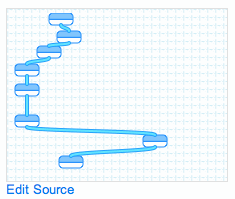

! 2021-12-24: This post is so out-dated it makes my head spin. But worth keeping nevertheless.

The [preceding post] ~~http://jeremycherfas.net/blog/authentic-german-baking-is-growing-in-connecticut/~~ is something I am inordinately proud of. Doesn't look like much, does it? But trust me, it is.

!!! 2021-12-24: Nothing to look at, in fact, because it was so devoid of content I decided not to bring it in. But that doesn’t spoil the rest of the story.

A while ago I discovered [Scoop.it](https://www.scoop.it/t/bread/), which makes content curation rather easy. Content curation is, of course, nothing new. I like to think that's exactly what I’ve been doing here and at [the other place](https://agro.biodiver.se/). Scoop.it has a nifty interface for presenting to you content you might be interested in curating, and a community so that you can see, and share, content others are curating. So far, so good. But there was one, gigantic, fly in in the ointment. Every link from Scoop.it took you not to the content, but back to Scoop.it, which presumably made some sense to them. As I [ranted at the time](http://jeremycherfas.net/blog/if-you-love-something-set-it-free/):

> Daft, really. Scoop says it can’t really be bothered to develop a more useful RSS structure, and the API is there for all who want to take advantage of that kind of stuff, but while I might be able to develop the smarts to do that, I don’t really have the time or the inclination.

{.left} And yet ... this kept annoying me. About six weeks ago, I had an ahah moment. Scoop.it kindly provides, as I noted, an RSS feed, albeit a less than fully useful one. And Yahoo Pipes can do stuff with RSS feeds. Alas, life intervened for five and a half weeks (as evidenced by the lack of content right here). But because Scoop.it does make things easy, much easier than, say, the WordPress PressIt doohickey, I kept doing little things there. And it came to annoy me more and more that sharing those things in any way kept people confined within Scoop.it for at least two clicks. Then came the last straw. For just $12.99 a month -- a month, fer cryin’ out loud -- Scoop.it would “give” my content -- mine because I found it and shared it and gave it some interpretation, sometimes -- back to me.

{.left} So off I went to Yahoo and [built me a pipe] ~~http://pipes.yahoo.com/pipes/pipe.info?_id=ad723b6a5de2575c93989e3074bb38f9~~.[^fn1] I had a lot of help from people there and elsewhere to understand bleedin’ regex, and it still isn’t perfect by any means. But at least the links now point directly to the original items, for your clicking ease. And thanks to a WordPress plugin called [FeedWordPress](https://fwpplugin.com/),[^2] I can take the output of the Pipe and have each item show up as a post here, pending my approval and editing. Which means that I can keep using Scoop.it when life is busy, and keep feeding this site with stuff. The main change I ought to make is to give a bit more spin over at Scoop.it, knowing that stuff will eventually fetch up here.

What a nice Chrissie Pressie to myself, and my legion of reader.

[^fn1]: And you can do the same, should you need to, using mine as a basis. *2021-12-24: Or rather, you could have done, back then. Because, Yahoo.*

[^2]: Which could be put to nefarious ends, I am sure. 
