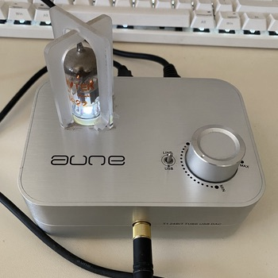

{.left} On a whim, encouraged by having solved a particularly nasty case of cable noise on a new microphone[^1], I dusted off an old tube headphone amp. The dust had accumulated over the years since I abandoned the amp because of a nasty, persistent, [somewhat high-pitched buzz](https://www.jeremycherfas.net/blog/just-listen-to-this-dac). Well, blow me if the buzz had not vanished. It was a treat to listen to some chill music, but I noticed when I turned the volume down that there was now a faint AC hum, barely noticeable when music plays. There are essentially two places where the hum might arise; the unearthed 15V transformer (via an adapter from US to EU plug) or the long cables connecting power supply to amp and amp to computer. 

What to do? One option might be an inline [Ground Loop Noise Isolator](https://www.amazon.it/VinTeam-Ground-Isolator-Sistema-Stereo/dp/B076J3GD74/ref=sr_1_8?keywords=ac+hum+eliminator&qid=1658486782&sr=8-8). That would need an adaptor to plug into the amp, but no biggie. An alternative could be a new transformer, preferably earthed, although those seem hard to find and would require fiddling with the DC input to the amp, which is via a DIN plug.

Or I could just ignore the hum and, indeed, the tube amp. It isn’t as if I have room on my desk for yet another audio set-up.

[^1]: Basically a crappy cable.
