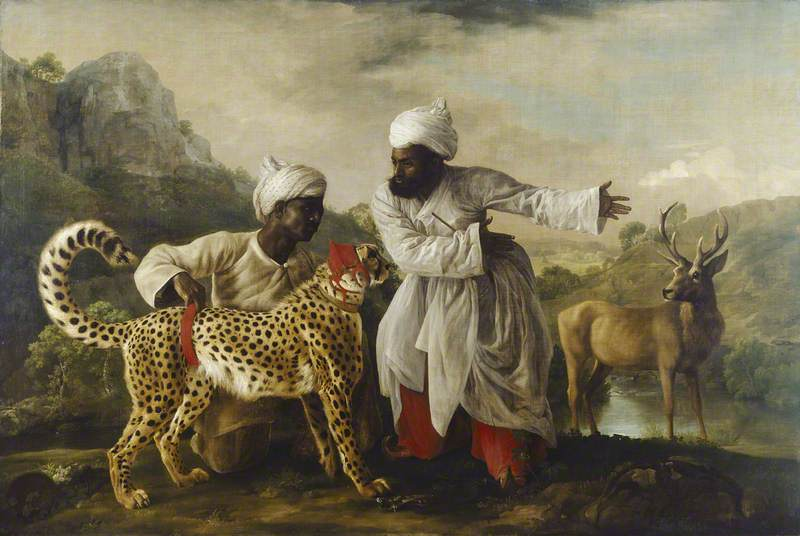

---
title: 'Hunting spectacle with cheetahs'
published: true
date: '14-05-2020 09:30'
taxonomy:
    category:
        - blog
    tag:
        - General
summary:
    enabled: '1'
subhead: " "
header_image: '0'
--- 

In 1984, I published a book about the past, present and future of zoos. One chapter was about the idea, quite new at the time, of behavioural enrichment. That is, giving animals the opportunity to perform some aspect of their natural behaviour. High-tech versions, like a contraption that fired live locusts into the fennec foxes’ enclosure at Antwerp Zoo. No tech versions, like simply making sure that the sea otters in the Seattle Aquarium had a supply of stones with which to demolish a bucket of clams. And all sorts of in-between examples.

===

I think behavioural enrichment of this sort is a great idea. It gives the animals a much more interesting life, which at the same time gives the public a much more interesting zoo visit. I also noted that zoo directors wouldn’t agree to some really interesting ideas because the public wouldn’t like it.

The chapter contained the following passage:

> We regard it as cruel to let animals live and die as they do in the wild, but nevertheless keep them in captivity. We are prepared to watch wild animals hunting on television, but not at the zoo.[^1] Why not go all the way and allow some of the big carnivores to exhibit their natural behaviour? I can think of few finer sights than that of a cheetah at full tilt after a gazelle, so why not let me see it in Regent’s Park or Whipsnade?

Of course I knew that cheetahs had been trained to hunt, but that had been hundreds of years ago. Luckily, probably, this was long before the internet and during a pretty hectic period in my life, so there was no way I could spend the time researching cheetah hunts as spectacle. Thus it was with total delight that I came across Jennifer Lee Noonan’s wonderful article [The Most Modern of Modern Sports](https://www.damninteresting.com/the-most-modern-of-modern-sports/) at Damn Interesting. What a thoroughly engrossing account of the moneyed English at their wackiest, and not only in modern times. 

The anecdote about the Duke of Cumberland (Sweet William or Butcher Cumberland, according to taste) triggered some long lost memory about a cheetah set after a stag in Windsor Great Park. And then I found it, the painting of *A Cheetah and a Stag With Two Indian Attendants* by George Stubbs. 

{.center} 

I think we may have considered it as an illustration for the book. It supposedly reflects the Duke of Cumberland setting the cheetah given to his nephew George III after a stag in Windsor Park. [Art historians claim](https://www.tate.org.uk/whats-on/tate-britain/exhibition/stubbs-celebration/stubbs-celebration-room-2) “the event was a tremendous disappointment“. Noonan says “when the antlers proved too formidable for the wild cat, it leapt over the netting and through the startled crowd to find easier prey in the forest,” which sounds not in the least bit disappointing to me.

Maybe I was onto something, back then. I will say no more, except to note that the article was indeed damn interesting.

!!! [Cheetah and Stag with Two Indians](https://artuk.org/discover/artworks/cheetah-and-stag-with-two-indians-206154#) by George Stubbs, photo credit: Manchester Art Gallery, licensed under [CC BY-NC-ND](https://creativecommons.org/licenses/by-nc-nd/4.0/)

[^1]: In context, the animals we are willing to watch being hunted at the zoo are cold-blooded so, you know, they don’t really count. 
