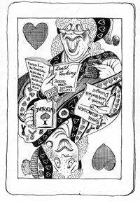

Neddie said “Dead to rights”. I'm not so sure.

# Handholder

{.left} You go out of your way to build bridges with people of different views and beliefs and have quite a few religious friends. You believe in the essential goodness of people, which means you're always looking for common ground even if that entails compromises. You would defend Salman Rushdie's right to criticise Islam but you're sorry he attacked it so viciously, just as you feel uncomfortable with some of the more outspoken and unkind views of religion in the pages of this magazine.  

You prefer the inclusive approach of writers like Zadie Smith or the radical Christian values of Edward Said. Don't fall into the same trap as super-naïve Lib Dem MP Jenny Tonge who declared it was okay for clerics like Yusuf al’Qaradawi to justify their monstrous prejudices as a legitimate interpretation of the Koran: a perfect example of how the will to understand can mean the sacrifice of fundamental principles. Sometimes, you just have to hold out for what you know is right even if it hurts someone's feelings.

**What kind of humanist are you? [Click here](https://newhumanist.org.uk/articles/2088/what-kind-of-humanist-are-you) to find out.**

! 2021-11-18: I had to do a bit of digging to relocate the quiz, and this may not even be the one I completed, as it is dated 2009. I took it again, and this time I seem to be a Hedonistic Humanist.
