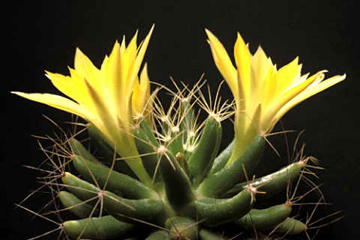
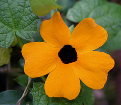

I've been getting into a gentle tizz over at [Botany Photo of the Day](http://www.ubcbotanicalgarden.org/potd/2006/05/gunnera_manicata.php) and [The Human Flower Project](http://www.humanflowerproject.com/index.php/weblog/comments/793/)[^1] on the subject of names. Latin names. OK, go ahead and mock; most people do. But the fact is that, _pace_ Wittgenstein, names do have meaning inasmuch as they allow us, in the absence of the thing itself, potentially to agree on what that thing is.

===

 {.center} 

Over at the Human Flower Project, Julie is merely perplexed by trying to work out the literal meaning of some Latin names. That's easy to understand. It is a different language, and one has to learn how it works. _Echinocereus_ could, at a stretch, be a hedgehog carrying a candle, but it is much more likely to be a candle bearing spines. At least Julie is trying (and I'm glad she wasn't growing _Mammillaria longimamma_).

But when Daniel at BPOTD refers to a plant as giant rhubarb or Chilean rhubarb, I get a little upset because the plant he shows is not a rhubarb, or even closely related to rhubarb (and to be fair, he was contrite about using the common name). If you were hungry, came across it, knew it as a rhubarb and also knew enough to cook rhubarb first, it still might not do you any good. The common name also begs the question of just what plant is in the photo. Originally identified as _Gunnera manicata_ (the name on its label) it has since been re-identified as _Gunnera tinctoria_. Why? Among other reasons, because _G. tinctoria_ is smaller than _G. manicata_ which, as it happens, is also known as giant rhubarb; I am not happy with there being something bigger than a giant, among  gunneras or anything else.

In other words, giant rhubarb does nothing to identify the plant species in question. _Gunnera tinctoria_ does. (So does _G. manicata_, of course, but wrongly.)

Another visitor to BPOTD, however, disagrees: "Once seemingly inappropriate common names are in use that use is a part of reality. Leaving them out of an account is an omission of facts about the plant in question."

As I said there, that simply is not true. Which of these flowers is black-eyed Susan?

 {.left} {.right}

Both, obviously, or I wouldn't be bothering.

It isn't as if the tyranny of the majority operates either. The world didn't vote on what the name of either of those plants should be (in English). And even if it had, who would enforce the decision? But we could agree that, in order to discuss them, we could call one _Rudbeckia hirta_ and the other _Thunbergia alata_. Botanical taxonomists would still discuss whether some names were correct and proper, but that would be a specialized discussion for the good of all, and the number of cases in dispute is actually tiny.

I like Latin names because once you have cracked the code, they are descriptive. They give an indication of relationships too, which can be handy. I've never understood, for example, how the same plant can be both a chick pea and a garbanzo bean. Is it a pea or a bean? Is a sweet pea sweet? Is it even edible? And back with the rhubarbs, false rhubarb is a real rhubarb (_Rheum rhaponticum_), but I'd sooner eat garden rhubarb (_Rheum rhabarbarum_).

In the end, names matter because they aid accurate communication. Latin names happen to make that communication easiest.

_Mammillaria longimamma_ photo from [Hobby Fotografie](http://www.photohomepage.de/galerien_naturfotografie_kakteen_mammillaria_longimamma.htm). _Rudbeckia hirta_ photo from [Shooting Star Native Seeds](http://www.shootingstarnativeseed.com/photo.htm).[^1] (Slightly mislabelled) _Thunbergia alata_ photo from [petrichor](http://www.flickr.com/photos/petrichor/) on flickr.

[^1]: 23 January 2016: Dead and gone, alas.