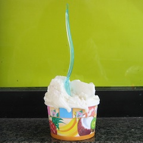

A man needs a purpose to get the most out of life. My purpose last Saturday was to sample ice creams. Not any old ice creams, but those [recommended by Elizabeth Minchilli](http://elizabethminchilli.blogspot.com/2010/05/gelato-in-rome.html) a couple of months ago. [^fn1] My original plan was to visit all the establishments she mentioned and compare my impressions with hers. When I mentioned this foolishness to my friend Julian the night before, he set his razor-sharp scientific mind to bear on the problem and announced that it was daft to try different flavours at different places.

"One might specialise in frutta, another in crema. Apples and oranges," he dismissed my plan. [^fn2]

Come Saturday, off I rode, to try limone and fior di latte wherever I could. My initial inkling was hazelnut, one of the most difficult ice creams to get right, in my opinion, and melon, which is in season, but that seemed a bit much.

{.left} First stop, The Bridge, hard by the wall of the Vatican. A dingy spot, with the workshop visible behind the staff-crowded counter. The lemon was tart, very fruity and natural tasting, with a good hint of bitterness. The fior di latte was smooth and dense. I knew I needed to pace myself, so reluctantly I abandoned the cup halfway through. That hurt.

{.left} On to Fatamorgana, twee beyond belief (and with a website that gave me a headache after two minutes.) Their lemon was intense, very solid, no bitterness at all and very fruity. The fior di latte was light and sweet with no real flavour. Points lost for being the only place to use a plastic cup. However, also used a real scoop, rather than a paddle, and rinsed it under the tap between flavours. Is that a good thing?

{.left} Al Settimo Gelo was not easy to find; that area of Prati is a closed book to me, but when I did find it I was really glad that I had decided on my flavours beforehand. Here were temptations (almost) beyond resisting: Iranian pistachio; cardamom; sesame and honey; barolo and prunes. Another time. And alas, the vanilla (no fior di latte) was disappointing, shot through with small chunks of pure fat. The flavour was good, with teeny vanilla seeds throughout, but those crumbs of fat were bad. The lemon was light and not very fruity, and maybe a bit too sweet. Perhaps one to come back to, specifically for some of those other flavours.

{.left}  del Teatro was definitely The Find. Unlike Settimo Gelo, which nobody but a local could ever just stroll past, this is just off the via dei Coronari, and I must have strolled past it scores of times without noticing it. Again, scads of “interesting” flavours (white chocolate and basil anyone?). Maybe too interesting, because when I asked for limone I was offered torta di limone instead.  The limone was brilliant. Stunning, my notebook says, like frozen fresh lemonade. The crema (no fior di latte) was gooey and too sweet. Maybe, like Al Settimo Gelo, del Teatro is too focused on the fancy stuff to take care of basics. Regardless, this is one I will be detouring towards on rambles downtown.

At that point, I decided I had had enough. I wasn’t about to go to San Crispino just for the hell of it. I know their stuff, and rate it very highly indeed, but I’m not sure they bother with anything as mundane as lemon or vanilla. And the Giolitti story is too complex for a quick taste. That leaves just one of Elizabeth’s list to try, which will have to await another expedition.

{.left} And there it would have ended, had I not gone out for supper with friends last night and been bowled over by Ruth’s plain vanilla. Absolutely wonderful, in a perfect kind of way. Texture, flavour, absence of fatty lumps. This ice cream had it all. So it takes a lot of work. so what? It was worth it. This vanilla beat the best I’ve tasted in Rome.

[^fn1]: And see her post for addresses, websites and all that stuff. I'm here to report on taste. *2021-08-11:* Well, this is weird. Her blog is now by invitation only. I wonder whether she transferred all her previous stuff to her own website. [Of course she did](https://www.elizabethminchilli.com/2010/05/gelato-in-rome/)! And she updates regularly, which I have not for this post.

[^fn2]: I forbore to point out that apples and oranges are both fruits; I'm sure he was being metaphorical. 
