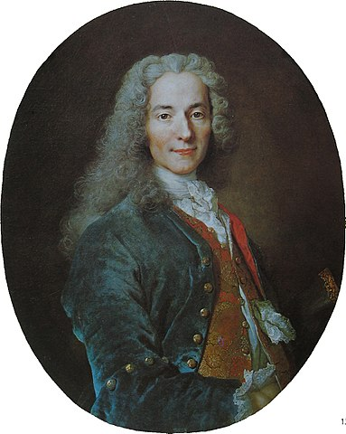

> It is with books as with the fire in our hearths; we go to a neighbour to get the embers and light it when we return home, pass it on to others, and it belongs to everyone. 

{.center}

That Voltaire, what a card! He says something seemingly simple, like “The best is the enemy of the good,” (or, more likely, _“Le mieux est l'ennemi du bien”_) and 236 years later it is still both true and incomprehensible.

I know this because I’ve spent the best part of the past 48 hours worrying about teeny little details of the gift-wrap rather than what’s in the box. Finally I forced myself to accept that even though one of the loops on that bow is larger than the other, and there’s a small tear in the paper, I better hand over the box.

Here it is: [A voice for N.I. Vavilov](http://www.vaviblog.com/).

! **2021-10-06: Do not click the link. It goes nowhere. Now. But it did once. And the exercise of adding each of these posts on the day it was first written has shown me that the way to bring that site back will be to do the same thing once I have finished this site.**

And that’s all I am going to say about it, for now.

Back to old M. Arouet. What did he mean? The standard view is the one I used above: that if you spend too much effort on trying to achieve perfection, the very best, you may not get something that is perfectly adequate. That is pretty straightforward. But there is another interpretation. What if the best is the enemy of the good in the sense that it actively fights against the good? What if the very act of striving for perfection directly helps one to see that the merely adequate isn’t actually good enough?

I prefer that view, natch, because it suggests I wasn’t in fact wasting my time. That I wasn’t procrastinating, but polishing.

But it isn’t that simple. If [content alone](https://web.archive.org/web/20061018185614/http://www.nngroup.com/) is king, then the gift-wrap is irrelevant; a bog-standard default out-of-the-box box is enough. If context is everything, then [Lorem ipsum](http://www.lipsum.com/) rules and my life as an inky wretch has been pointless. I want to strike a balance. I also know that both content and context are endlessly tweakable, but that tweaking context results in an almost endless series of micro-thrills. Who can resist that roller-coaster ride when the alternative is to stare at the blank page.

The interwebs make even writing a roller-coaster, with temptation a click away. Next time, for example, I won’t bother with Voltaire. I’ll go all smarty-pants, courtesy of [Wikiquote](https://en.wikiquote.org/wiki/Voltaire), and mention casually that Voltaire’s epigram “also appears in Italian (_Il meglio è l'inimico del bene_) in the Questions sur l'Encyclopédie article, 'Dramatic Art' (1764)”.[^1]

[^1]: 2021-10-06: The citation has now, of course, changed, but thankfully this website is not in fact a wiki.

And that should be the end of it, except that I’m certain that some time ago I read something about Hemingway and blank pages. I click. I Google. And I come up with a wonderful article by [Gabriel Garcia Marquez](http://www.nytimes.com/books/99/07/04/specials/hemingway-marquez.html), in which I find:

> [E]ach day’s work should only be interrupted when one knows where to begin again the next day. I don’t think that any more useful advice has ever been given about writing. It is, no more and no less, the absolute remedy for the most terrible specter of writers: the morning agony of facing the blank page.

And so to bed.

