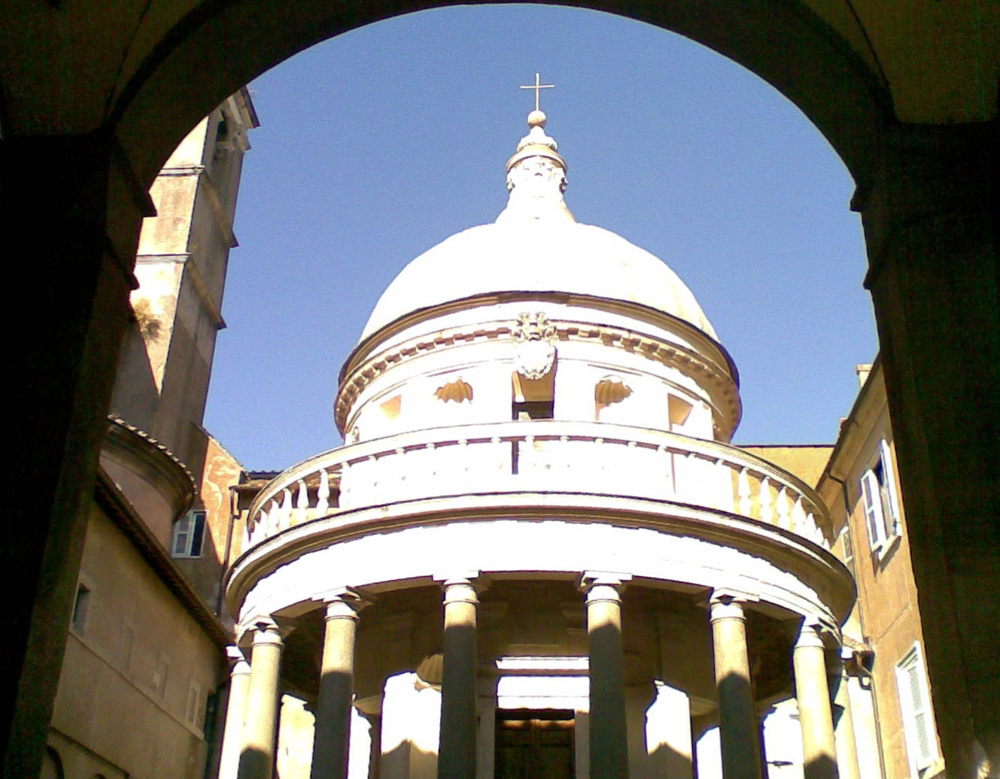
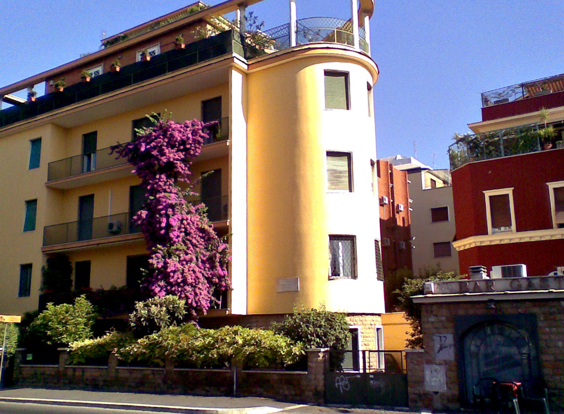
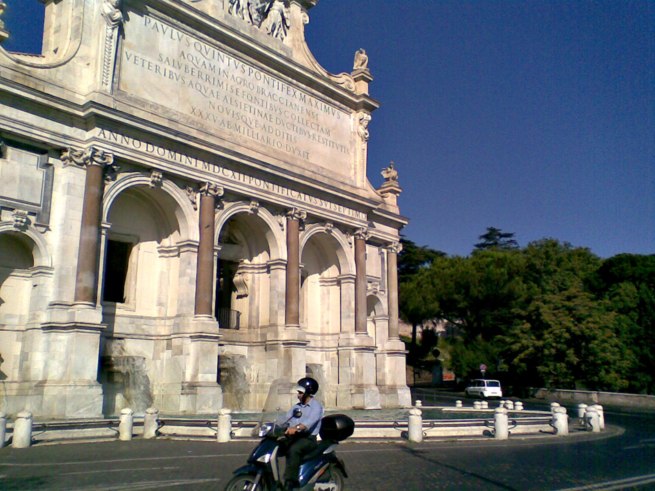
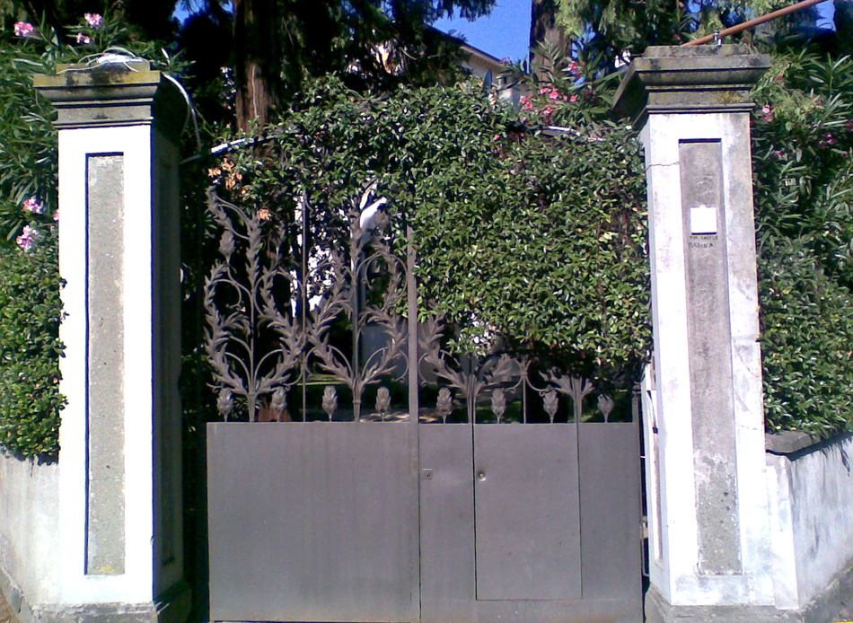
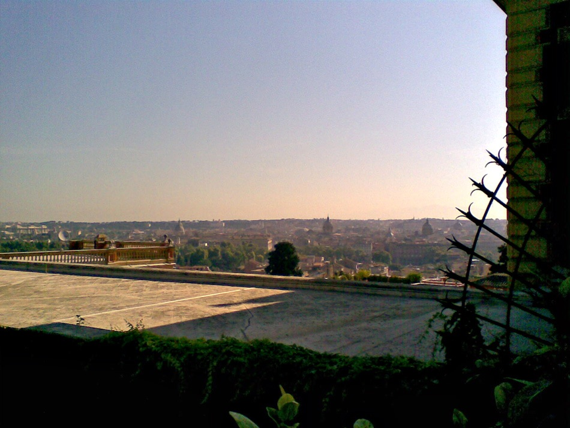

{.center}

It was going to be just an ordinary Sunday morning walk, but we were planning on about double the normal distance because our appointment for coffee was an hour away. The air was wonderfully fresh, a fine contrast to the night before’s heat which had mired me in lethargy. The streets were just about empty too; not that it was terribly early, but the Romans are mostly out of the city. So it was one of those walks when you look up and suddenly realize not only where you are but also that you have really no recollection of having got there. The Tempietto looked so beautiful behind its locked gates, but of course I hadn’t expected this and so was camera-less. Not quite. And I actually quite like the way the phone has blown out all the detail in the highlights. Framing is hard, as is seeing what you’ve done, so I’m disproportionately pleased with the outcome.

And then, of course, there were photos waiting to be taken wherever I looked.

{.center}

{.center}

{.center}

{.center}

It might be fun to really work with phone images some time. For now, I’m just glad to have at least some sort of record.

The freshness didn’t last, of course. It rained today for five minutes, onto hot tarmac, and now I’m living inside a hot towel.
